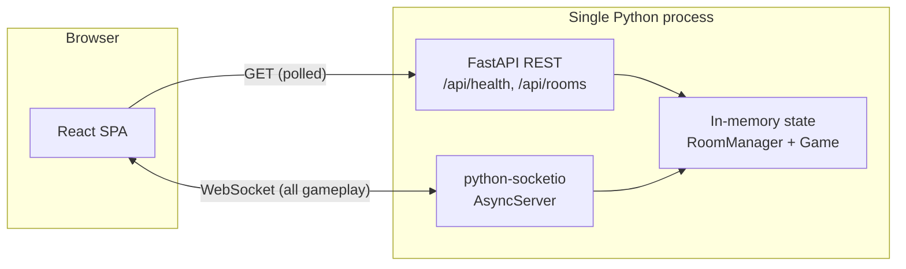

# Sketchy

An online multiplayer drawing & guessing game, iSketch/Pictionary-style: one player draws a
secret word while everyone else races to guess it in the chat. Join a public lobby or create a
private room with a friend code — no accounts, no database, just a nickname and a link.

## Features

- Public lobby with a live, polled list of open rooms, or join a private room by code.
- Turn-based rounds: each player draws once per round, choosing from 3 word options.
- Real-time synced canvas (freehand pen + rectangle/ellipse/triangle shape tools).
- Live guess chat with scoring based on how fast you guess.
- Reconnection grace period (30s) — refreshing mid-game rejoins you with your score intact.
- Score system designed to resist "sandbagging": drawers can't game an easy word by stalling,
  since their bonus scales with how fast guessers actually answered (see
  [Scoring](#scoring) below).

## Architecture

Single-process backend holding all game state in memory — no database, no Redis. Built for
self-hosting at "friends playing together" scale, not internet-wide concurrency.



- **REST** is only used for `GET /api/health` and `GET /api/rooms` (the public lobby list,
  polled every 4s by the client).
- **Everything else** — creating/joining rooms, starting the game, choosing words, drawing,
  guessing, chat — goes through Socket.IO events. There's no REST endpoint for room creation;
  players need a live socket connection anyway, so it's simpler to do it all over the socket.
- **No accounts**: a player is a nickname + a client-generated UUID token, stored in
  `localStorage` per room code (`sketchy_token_<code>`), used to reconnect within the grace
  period.

## Tech stack

| Layer    | Technology |
|----------|------------|
| Backend  | Python 3.14, FastAPI, python-socketio (`AsyncServer`, ASGI), uvicorn |
| Frontend | React 19, TypeScript, Vite, react-router-dom, zustand, socket.io-client |
| Testing  | pytest + pytest-asyncio (backend unit tests) |

## Project structure

```
backend/
  app/
    main.py       ASGI entrypoint - wires FastAPI + Socket.IO together, REST endpoints
    events.py     All Socket.IO event handlers (room lifecycle, turns, drawing, guessing)
    game.py       Pure game state machine (turns, word choice, scoring) - no I/O, unit-testable
    rooms.py      In-memory Room/Player/RoomManager domain model
    state.py      Shared RoomManager singleton
    words.py      Word list + random choice helper
  tests/          pytest unit tests for game.py and rooms.py
frontend/
  src/
    components/   Canvas, Toolbar, PlayerList, WordDisplay, Timer, GuessChat
    pages/        LobbyBrowserPage (home), GameRoomPage (room/gameplay)
    store/        zustand global game state store
    hooks/        useGameSocketListeners - registers all socket listeners once
    lib/socket.ts socket.io-client singleton + REST base URL
    types.ts      Shared TypeScript types for all socket payloads
```

## Getting started

Requires Python 3.11+ and Node 20+.

### Quick start

```bash
./scripts/serve.sh
```

Installs backend/frontend dependencies, builds the frontend, runs the backend test suite, then
starts a single local server on http://localhost:8000 that serves the built frontend alongside
the API/WebSocket (see [Production build](#production-build) below). Useful flags:

```bash
./scripts/serve.sh --skip-build   # reuse the existing frontend/dist
./scripts/serve.sh --skip-tests   # skip the pytest run
./scripts/serve.sh --force        # kill whatever is already listening on the port first
PORT=9000 ./scripts/serve.sh      # serve on a custom port
```

For frontend development with hot-reload instead, follow the Backend/Frontend steps below and
run each independently.

### Backend

```bash
cd backend
python3 -m venv .venv
.venv/bin/pip install -r requirements.txt
.venv/bin/uvicorn app.main:app --port 8000
```

Runs on http://localhost:8000. `GET /api/health` should return `{"status": "ok"}`.

### Frontend

```bash
cd frontend
npm install
npm run dev
```

Runs on http://localhost:5173 (Vite dev server) and talks to the backend at
`http://localhost:8000` by default. Override with an env var if needed:

```bash
# frontend/.env
VITE_SERVER_URL=http://localhost:8000
```

Open the dev server URL in two separate browser profiles/incognito windows to test with
multiple players — this app persists a per-room session token in `localStorage`, so multiple
tabs in the *same* browser profile will share that storage and can behave unexpectedly.

### Running tests

```bash
cd backend
.venv/bin/pytest
```

`game.py` and `rooms.py` are pure logic (no sockets), so they're covered directly by unit
tests. `events.py` (the socket handlers) is best exercised with a real Socket.IO client
against a running server for end-to-end checks.

### Production build

```bash
cd frontend && npm run build   # outputs frontend/dist
cd ../backend && .venv/bin/uvicorn app.main:app --host 0.0.0.0 --port 8000
```

When `frontend/dist` exists, `app/main.py` mounts it as static files on the same FastAPI app,
so the whole game (UI + API + WebSocket) is served from a single port.

## Game flow

1. **Lobby**: pick a nickname, then create a room (public or private, with a max player count
   and number of rounds) or join one by code.
2. **Waiting room**: once 2+ players have joined, the host clicks **Start game**.
3. **Choosing word** (15s): the current drawer picks one of 3 word options.
4. **Drawing** (80s): the drawer draws; everyone else sees a masked word (`_ _ _ _`) and
   guesses in the chat. The round ends early once everyone's guessed correctly.
5. **Round end** (5s): the word is revealed and scores update, then the next player's turn
   begins.
6. Repeat until every player has drawn once per configured round count, then **game end**
   shows final scores.

### Scoring

- A correct guess scores `max(10, round(100 * remaining_seconds / 80))` — guess fast for up to
  100 points, or at least 10 points however late (as long as it's before the round ends).
- The drawer's bonus is the sum of each correct guesser's points, scaled down to a `10`-point
  baseline (`round(guesser_points * 10 / 100)`) — so a drawer who reveals the word quickly and
  lets everyone guess promptly earns the full bonus, while stalling until the last few seconds
  (to game an easy word) also shrinks their own bonus, not just everyone else's.

### Reconnection & disconnection

- On disconnect, a player has 30 seconds to reconnect (with their stored token) and keep their
  score, connection, and place in the turn order.
- If the drawer disconnects and doesn't return in time, their turn is skipped and evicted from
  the rotation.
- If everyone disconnects, the room is cleaned up.

## Key design decisions & limitations

- **No persistence**: all state lives in process memory. Restarting the backend clears every
  room. This is intentional for the "self-hosted for a group of friends" scale — no DB/Redis
  ops overhead.
- **No auth**: reconnection relies on a client-side token in `localStorage`, not a password or
  account. Anyone with the room code can join a public/private room.
- **Single process**: no horizontal scaling story; one uvicorn worker holds all rooms. Fine for
  small deployments, not for internet-scale traffic.
