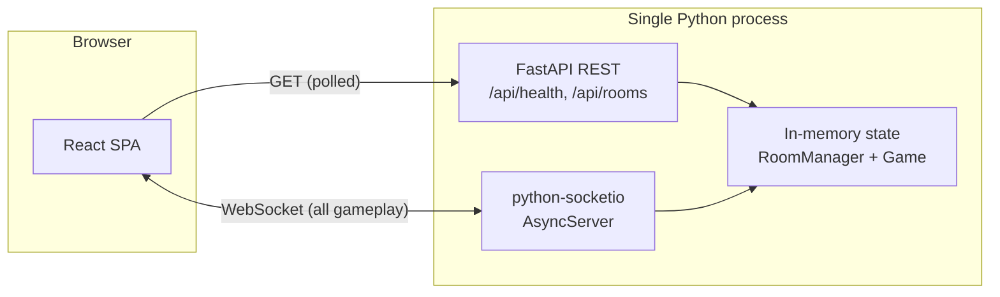

# Sketchy

An online multiplayer drawing & guessing game, iSketch/Pictionary-style: one player draws a
secret word while everyone else races to guess it in the chat. Join a public lobby or create a
private room with a friend code — no accounts, no database, just a nickname and a link.

## Features

- Public lobby with a live, polled list of open rooms, or join a private room by code.
- Turn-based rounds: each player draws once per round, choosing from 3 word options.
- Real-time synced canvas (freehand pen + rectangle/ellipse/triangle shape tools).
- Spectator mode — join any room as a spectator (even when full), with optional room creation setting to reveal the secret word solution, and private spectator chat restricted to the drawer, spectators, and correct guessers.
- AFK mode — toggle AFK status anytime so you are skipped for drawing turns and not waited for during rounds.
- Vote kick and vote AFK — room players can vote to kick or mark another player AFK by a strict majority of connected, non-spectator players. AFK players and the vote target count toward that population; disconnected players and spectators do not. Spectators cannot cast votes or be selected as moderation targets.
- Save image — download the current drawn image directly as a PNG file at any time.
- Customization option to always hide masked prompt word length and composition from guessers (forces hints off).
- Optional scoring, selected when the room is created.
- Reconnection grace period (30s) — refreshing mid-game rejoins you with your score intact.
- Score system designed to resist "sandbagging": drawers can't game an easy word by stalling,
  since their bonus scales with how fast guessers actually answered (see
  [Scoring](#scoring) below).

## Architecture

Single-process backend holding all game state in memory — no database, no Redis. Built for
self-hosting at "friends playing together" scale, not internet-wide concurrency.


```mermaid
flowchart LR
    subgraph Browser
        UI[React SPA]
    end
    subgraph Server[Single Python process]
        REST["FastAPI REST\n/api/health, /api/rooms"]
        IO["python-socketio\nAsyncServer"]
        State["In-memory state\nRoomManager + Game"]
    end
    UI -- "GET (polled)" --> REST
    UI <-- "WebSocket (all gameplay)" --> IO
    REST --> State
    IO --> State
```

- **REST** is only used for `GET /api/health` and `GET /api/rooms` (the public lobby list,
  polled every 4s by the client).
- **Everything else** — creating/joining rooms, starting the game, choosing words, drawing,
  guessing, chat — goes through Socket.IO events. There's no REST endpoint for room creation;
  players need a live socket connection anyway, so it's simpler to do it all over the socket.
- **No accounts**: the server assigns each player a public `playerId` plus a private reconnect
  secret. Only the secret is stored in `localStorage` per room code
  (`sketchy_reconnect_secret_<code>`), and it is never included in shared room or game payloads.

## Tech stack

| Layer    | Technology |
|----------|------------|
| Backend  | Python 3.14, FastAPI, python-socketio (`AsyncServer`, ASGI), uvicorn |
| Frontend | React 19, TypeScript, Vite, react-router-dom, zustand, socket.io-client |
| Testing  | pytest + pytest-asyncio (backend unit tests), Playwright (multi-browser E2E testing) |

## Project structure

```
backend/
  app/
    main.py       ASGI entrypoint - wires FastAPI + Socket.IO together, REST endpoints
    handlers/
      __init__.py    Registers all handler domains and returns their lifecycle context
      context.py     Shared HandlerContext for Socket.IO, rooms, timers, and game flow
      auth.py        Current-player authentication and stale-socket rejection
      rooms.py       Room creation, joining, settings, previews, and player lifecycle
      game.py        Game start and word-selection transport handlers
      drawing.py     Drawing, undo, and canvas synchronization handlers
      chat.py        Guessing, chat, and purchasable hint handlers
      moderation.py Vote-kick and AFK handlers
      connection.py Socket connect/disconnect and reconnect-grace handling
      payloads.py    Typed boundary models and parsers for every client command
    services/
      game_flow.py Shared turn, round, timer, and player-removal workflows
      timers.py    Application-owned asynchronous timer lifecycle
    presenters.py Pure construction of room, turn, round, and session payloads
    game.py       Pure game state machine (turns, word choice, scoring) - no I/O, unit-testable
    rooms.py      In-memory Room/Player/RoomManager domain model
    state.py      Shared RoomManager singleton
    words.py      Word list + random choice helper
  tests/
    handlers/     Focused asyncio integration suites for each Socket.IO handler domain
    e2e/          Multi-browser Playwright scenarios
    test_*.py     Domain, protocol, payload, timer, and performance unit tests
frontend/
  src/
    components/   Canvas, Toolbar, PlayerList, WordDisplay, Timer, GuessChat
    pages/        LobbyBrowserPage (home), GameRoomPage (room/gameplay)
    store/        zustand global game state store
    hooks/        useGameSocketListeners - registers all socket listeners once
    lib/socket.ts socket.io-client singleton + REST base URL
    types.ts      Shared TypeScript types for all socket payloads
```

## Getting started

Requires Python 3.11+ and Node 20+.

### Quick start

```bash
./scripts/serve.sh
```

Installs backend/frontend dependencies, builds the frontend, runs the backend test suite, then
starts a single local server on http://localhost:8000 that serves the built frontend alongside
the API/WebSocket (see [Production build](#production-build) below). Useful flags:

```bash
./scripts/serve.sh --skip-build   # reuse the existing frontend/dist
./scripts/serve.sh --skip-tests   # skip the pytest run
./scripts/serve.sh --force        # kill whatever is already listening on the port first
PORT=9000 ./scripts/serve.sh      # serve on a custom port
```

For frontend development with hot-reload instead, follow the Backend/Frontend steps below and
run each independently.

### Backend

```bash
cd backend
python3 -m venv .venv
.venv/bin/pip install -r requirements.txt      # runtime only
# .venv/bin/pip install -r requirements-dev.txt  # runtime + pytest/Playwright
.venv/bin/uvicorn app.main:app --port 8000
```

Runs on http://localhost:8000. `GET /api/health` should return `{"status": "ok"}`.
Install `requirements-dev.txt` instead when you plan to run unit, integration, or E2E tests.

### Frontend

```bash
cd frontend
npm install
npm run dev
```

Runs on http://localhost:5173 (Vite dev server) and talks to the backend at
`http://localhost:8000` by default. Override with an env var if needed:

```bash
# frontend/.env
VITE_SERVER_URL=http://localhost:8000
```

Open the dev server URL in two separate browser profiles/incognito windows to test with
multiple players — this app persists a per-room reconnect secret in `localStorage`, so
multiple tabs in the *same* browser profile will share that credential and reconnect as the
same player.

### Running tests

```bash
# Install test/dev deps once (pytest, Playwright, …)
cd backend && .venv/bin/pip install -r requirements-dev.txt

# Unit & integration tests
.venv/bin/pytest

# Backend performance micro-benchmarks
backend/.venv/bin/python benchmarks/backend.py
backend/.venv/bin/python benchmarks/live_drawing.py

# End-to-end canvas benchmarks (desktop + throttled mobile)
./benchmarks/run_canvas.sh

# Faster local iteration on one profile, with optional JSON output
./benchmarks/run_canvas.sh --profiles desktop --json-output /tmp/canvas-benchmark.json

# Multi-browser Playwright E2E tests (install browsers once first)
backend/.venv/bin/python -m playwright install chromium firefox
./scripts/test-e2e.sh
```

The canvas benchmark starts the built application on an isolated local port
(`8765` by default), creates a real two-player game, and reports
drawer-to-observer stroke latency, large-fill latency, Undo/replay latency,
and the `sync_strokes` WebSocket payload size. Results are diagnostic baselines,
not CI pass/fail thresholds, because browser timings vary by machine. The
`mobile` profile uses a 390×844 viewport and 4× CPU throttling. Override the
port with `PORT=<number>` when needed.

`game.py` and `rooms.py` are pure logic (no sockets), covered by direct unit tests. Top-level Socket.IO handlers are grouped by domain under `app/handlers` and covered by focused asyncio integration suites in `backend/tests/handlers`. Cross-domain turn, round, timer, and player-removal workflows live in `services/game_flow.py`, while pure outgoing payload construction lives in `presenters.py`. Client JSON commands are validated as strict object payloads in `handlers/payloads.py`; values are not coerced, booleans are never accepted as integers, and bounded validation completes before authorization or mutation. The compact binary drawing and fixed-array undo commands have dedicated parsers for their documented wire formats. Playwright E2E tests in `backend/tests/e2e` cover real-time multi-browser room sessions, settings persistence, AFK status, and disconnection sync across Chromium and Firefox.

### Production build

```bash
cd frontend && npm run build   # outputs frontend/dist
cd ../backend && .venv/bin/uvicorn app.main:app --host 0.0.0.0 --port 8000
```

When `frontend/dist` exists, `app/main.py` mounts it as static files on the same FastAPI app,
so the whole game (UI + API + WebSocket) is served from a single port.

## Game flow

1. **Lobby**: pick a nickname, then create a room (public or private, with a max player count
   and number of rounds), choose default scoring or a score-free casual game, or join one by
   code.
2. **Waiting room**: once 2+ players have joined, the host clicks **Start game**.
3. **Choosing word** (15s): the current drawer picks one of 3 word options.
4. **Drawing** (80s): the drawer draws; everyone else sees a masked word (`_ _ _ _`) and
   guesses in the chat. The round ends early once everyone's guessed correctly.
5. **Round end** (5s): the word is revealed and scores update, then the next player's turn
   begins.
6. Repeat until every player has drawn once per configured round count, then **game end**
   shows final scores.

### Scoring

- Room creators can choose **Default scoring** or **No scoring**. No-scoring games still detect
  correct guesses and end rounds normally, but everyone remains on zero points and no
  leaderboard is shown.
- A correct guess scores between 100 and 300 points based on time remaining: `round(100 + 200 * remaining_seconds / 80)` — guess quickly for up to 300 points, or 100 points minimum near the deadline.
- The drawer receives the sum of points earned by all correct guessers in that round (`drawer_score = sum of guesser scores`), balancing drawing and guessing potential across complete rotations.

### Spectating

- Players can join any room (including full rooms) as a spectator. Spectators do not draw or earn scores.
- By default, spectators see the masked word like active guessers, but room creators can enable **Allow spectators to see the word**.
- Spectator chat messages are restricted to the drawer, spectators, and players who have already guessed, keeping active guessers spoiler-free.

### Reconnection & disconnection

- On disconnect, a player has 30 seconds to reconnect with their private stored secret and keep
  their score and place in the turn order. A successful reconnect replaces the player's active
  socket, so the superseded socket can no longer issue commands.
- If the drawer disconnects and doesn't return in time, their turn is skipped and evicted from
  the rotation.
- If everyone disconnects, the room is cleaned up.

## Key design decisions & limitations

- **No persistence**: all state lives in process memory. Restarting the backend clears every
  room. This is intentional for the "self-hosted for a group of friends" scale — no DB/Redis
  ops overhead.
- **No accounts**: reconnection uses a bearer-style secret in `localStorage`, not a password or
  user account. The public player ID is safe to broadcast but cannot be used to reconnect.
  Anyone with the room code can still join a public/private room as a new player or spectator.
- **Single process**: no horizontal scaling story; one uvicorn worker holds all rooms. Fine for
  small deployments, not for internet-scale traffic.
- **Versioned hybrid drawing protocol**: live drawing actions share one compact Socket.IO
  event. Data-bearing path, shape, and fill actions use binary attachments with fixed-width
  colors, widths, shape IDs, and quarter-pixel signed coordinates. Path-end and clear use
  their version/action byte directly as a numeric control payload, avoiding Socket.IO's
  binary-attachment envelope when it would be larger than the action itself. The server
  rejects malformed, unsupported, unauthorized, and out-of-phase payloads before recording
  or rebroadcasting them.
- **Versioned canvas history**: rooms keep drawing actions in a contiguous packed byte buffer
  with compact action offsets, and send replay history in a versioned binary envelope
  containing its action-offset table and packed records. Packed paths use quarter-pixel
  signed 16-bit coordinates and one-byte widths; packed shapes additionally use a one-byte
  shape enum. The frontend retains the versioned `{v, a}` JSON history decoder as a
  compatibility fallback.
