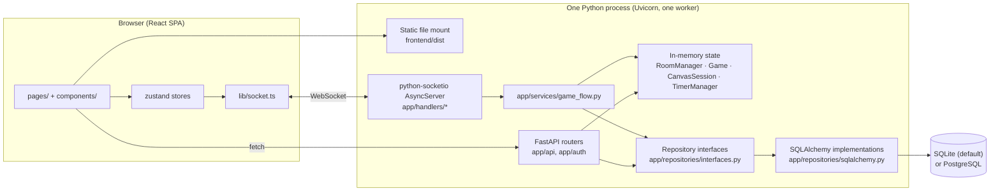

# Architecture

Sketchy is an online multiplayer drawing-and-guessing game. This document describes
how the running system is put together: the processes, the layers inside them, who
owns which state, and where a change to one of them forces a change somewhere else.

Companion documents:

- [`wire-protocol.md`](wire-protocol.md) — the exact Socket.IO and REST contract between the two halves.
- [`database.md`](database.md) — every table, its columns, and the flows that write them.
- [`requirements.md`](requirements.md) — what the system is required to do, and what it deliberately does not do.
- [`ui-mockups/`](ui-mockups/) — an artboard per screen, matched to the shipped styles, plus the redesign rationale. What the frontend described here actually looks like. [`ui-mockups/mobile/`](ui-mockups/mobile/README.md) is the portrait-phone counterpart: a measured review of the same screens at 390 × 844, and the layouts that answer it. Those have shipped; the artboards are the reference for the phone build the way the desktop set is for the wide one.
- [`../GLOSSARY.md`](../GLOSSARY.md) — the one agreed name per concept. Read it before naming anything a player can see.
- [`../README.md`](../README.md) — the operator- and player-facing narrative; this document is the structural one.

---

## 1. Shape of the system

Two deployable artifacts, normally served from one port:

| Artifact | Language | Entry point |
| --- | --- | --- |
| Backend | Python 3.14 | [`backend/app/server.py`](../backend/app/server.py) → [`backend/app/main.py`](../backend/app/main.py) |
| Frontend | TypeScript / React 19 | [`frontend/src/main.tsx`](../frontend/src/main.tsx) → [`frontend/src/App.tsx`](../frontend/src/App.tsx) |



`app = socketio.ASGIApp(sio, other_asgi_app=api, socketio_path="socket.io")`
([`backend/app/main.py:266`](../backend/app/main.py)) is the single ASGI application:
Socket.IO owns `/socket.io`, FastAPI owns everything else, and when
`frontend/dist` exists it is mounted as static files on the same app. That is what
makes single-port self-hosting and same-origin cookie sessions work without CORS
credentials or CSRF tokens.

### The single-worker rule

**v1 supports exactly one application worker.** Live rooms, games, canvases, timers,
Socket.IO sessions, and room-code lookup are process-owned. Startup rejects
`WEB_CONCURRENCY`/`UVICORN_WORKERS` values other than `1`
([`backend/app/deployment.py`](../backend/app/deployment.py)). A second worker would split one
logical service into inconsistent islands; shared PostgreSQL state does not change
that, and a Socket.IO message queue alone would not make multi-worker gameplay
correct.

Everything else in this document follows from that decision: in-process counters are
the true counters, a room-code reservation table exists to be race-safe *anyway*, and
horizontal scaling is an explicit non-goal rather than an undiscovered mode.

---

## 2. Backend layering

The backend is deliberately layered so that the interesting logic is pure and
unit-testable, and the I/O is thin.

```
app/server.py         Uvicorn runner with a draining shutdown
app/main.py           ASGI assembly: FastAPI + Socket.IO + static + lifespan
├── app/api/          REST routers (profiles, prompt lists, moderation, operations, …)
├── app/auth/         Accounts, sessions, email, moderation primitives, CLI commands
├── app/handlers/     Socket.IO transport adapters, one module per domain
│   └── payloads.py   Typed, strict validation of every client-originated command
├── app/services/     Cross-domain workflows and background loops
│   └── game_flow.py  The turn/round/timer/player-removal orchestration
├── app/presenters.py Pure construction of outgoing payloads
├── app/game.py       Pure game state machine — no I/O
├── app/rooms.py      In-memory Room/Player/RoomManager domain model
├── app/canvas_*.py   Canvas history, per-turn session, durable storage policy
├── app/live_drawing.py  Binary live-drawing frame codec
├── app/repositories/ Abstract interfaces + SQLAlchemy implementations
└── app/db/           SQLAlchemy models, engine setup, seeding, migration runner
```

### Layer responsibilities

**`app/game.py` — the pure state machine.**
`Game` owns phases, the turn rotation, prompt choice, hint economics, guess matching,
and scoring. It performs no I/O and touches no socket. `Phase` is
`choosing_prompt | drawing | turn_results | game_end`
([`backend/app/game.py:139`](../backend/app/game.py)). Scoring constants and the
versioned rule snapshot live here
([`backend/app/game.py:38`](../backend/app/game.py),
[`backend/app/game.py:370`](../backend/app/game.py)). This is the module to change when
game rules change — and changing an outcome-producing constant requires bumping
`SCORING_RULES_VERSION`.

**`app/rooms.py` — the live room model.**
`Room`, `Player`, `RestartVote`, `DrawingRecapEntry`, and `RoomManager`. A `Room`
outlives the `Game`s played in it. `RoomManager` is the process-wide registry, held
as a singleton in [`backend/app/state.py`](../backend/app/state.py) so REST routes and
Socket.IO handlers see the same rooms. Room settings and the recap buffer live
here, along with the room's own quick prompts; its **curated prompts do not**.
A room holds only what its selected lists were pinned to - the revision IDs, how
many prompts they hold, and a letter histogram for wheel pricing - and the
prompts themselves stay in the database until a game starts and draws the
bounded sample it can actually play (see `app/game.py` above). `to_state_payload()`
([`backend/app/rooms.py:511`](../backend/app/rooms.py)) and `to_public_summary()`
([`backend/app/rooms.py:483`](../backend/app/rooms.py)) are the two shapes the room is
published in.

**`app/handlers/*` — transport adapters, nothing more.**
Each module registers its events at the bottom in a `register(ctx)` function and does
the same four things in order: parse the payload, resolve the caller, authorize, then
delegate. `HandlerContext`
([`backend/app/handlers/context.py`](../backend/app/handlers/context.py)) carries the
`sio` server, the `RoomManager`, timers, repositories, the session factory, and the
optional services. Handler domains:

| Module | Owns |
| --- | --- |
| [`connection.py`](../backend/app/handlers/connection.py) | `connect`/`disconnect`, cookie→account binding, the 30-second reconnect grace, reconciling every seat a dropped socket still held |
| [`rooms.py`](../backend/app/handlers/rooms.py) | Create/join/leave, settings, previews, renames, colorblind suggestion |
| [`game.py`](../backend/app/handlers/game.py) | `start_game`, `select_prompt` |
| [`drawing.py`](../backend/app/handlers/drawing.py) | `draw`, `undo_stroke`, `request_sync_strokes` |
| [`chat.py`](../backend/app/handlers/chat.py) | `send_chat`, `guess`, `buy_hint`, `buy_wheel_letter` |
| [`moderation.py`](../backend/app/handlers/moderation.py) | `toggle_afk`, `vote_player`, `report_player` |
| [`restart.py`](../backend/app/handlers/restart.py) | `propose_restart_vote`, `cast_restart_vote` |
| [`lobby.py`](../backend/app/handlers/lobby.py) | `watch_lobby`, `unwatch_lobby`, `send_lobby_chat` - joining and leaving the lobby channel, and speaking into it |
| [`friends.py`](../backend/app/handlers/friends.py) | `add_friend`, `invite_friend`, `join_friend_room` — the two ways into a room nobody named |
| [`identity.py`](../backend/app/handlers/identity.py) | Resolving the account behind a socket into the name/color it plays under |
| [`sessions.py`](../backend/app/handlers/sessions.py) | Socket session resolution shared by handler domains |
| [`payloads.py`](../backend/app/handlers/payloads.py) | Strict typed validation for every inbound command |

**`app/services/game_flow.py` — the orchestrator.**
Anything that spans domains lives here: starting turns, ending turns, scheduling
phase and hint timers, removing a player from a running game, emitting canvas sync
and commit events, and persisting a finished game. When a handler needs to do more
than answer its own caller, it calls `GameFlowService`.

**`app/presenters.py` — pure payload construction.**
`room_state_payload`, `turn_payload`, `turn_ended_payload`, `session_payload`,
`system_chat_message`. Keeping these pure means the exact bytes a client sees are
unit-testable without a socket.

**`app/repositories/` — the persistence boundary.**
`interfaces.py` declares abstract `UserRepository`, `GameHistoryRepository`, and
`PromptListRepository` plus the input/output dataclasses that cross the boundary.
`sqlalchemy.py` implements them. Handlers and routers depend on the interfaces, never
on SQLAlchemy models directly. Services that are inherently relational (moderation,
runtime metrics, room presets, user settings, blocks) take an
`async_sessionmaker` instead — a deliberate exception where a repository abstraction
would only add indirection.

### The canvas subsystem

Three modules with three different commitments, and they must not be conflated:

| Module | Commitment |
| --- | --- |
| [`live_drawing.py`](../backend/app/live_drawing.py) | The **wire** format for one live action. Both ends deploy together, so a version bump is coordinated by definition. |
| [`canvas_history.py`](../backend/app/canvas_history.py) | The **in-memory** packed representation plus the versioned replay envelope (`SKCH`). |
| [`canvas_storage.py`](../backend/app/canvas_storage.py) | The **durable** format policy. Every format ever written keeps its decoder forever; decoders answer in the current wire format. |

`canvas_session.py` holds the per-turn protocol state: generation, sequence,
revision, rolling history hash, the acknowledgement window, and the replay-work
budget. Details of all of this are in [`wire-protocol.md`](wire-protocol.md).

---

## 3. Frontend layering

```
frontend/src/
├── main.tsx, App.tsx      Router, identity bootstrap, socket connection
├── pages/                 One component per route
├── components/            Canvas, toolbar, player list, dialogs, overlays
│   └── CrashBoundary.tsx  The class both crash boundaries use (R-UX-06); pages/CrashPage.tsx is its fallback
├── hooks/
│   ├── useGameSocketListeners.ts  Every server→client listener, registered once
│   ├── useCanvasProtocol.ts       Client half of the canvas sequencing protocol
│   └── useCanvasPointerInput.ts   Pointer → drawing action translation
├── store/
│   ├── gameStore.ts       Live room/game state
│   ├── authStore.ts       Account identity and role
│   ├── settingsStore.ts   Player settings (+ settingsMigrations.ts)
│   └── canvasBudgetStore.ts  Client-side replay-work budget
├── lib/                   Pure helpers, one concern per file; socket.ts is the singleton
│   ├── crashReport.ts     Pre-fills and redacts the crash page's bug report
│   └── crashTestSeam.ts   Diagnostics-build hook the E2E suite uses to make a screen throw
├── types.ts               Shared TypeScript types for every socket payload
└── styles/                CSS, one file per surface
```

Routes ([`frontend/src/App.tsx:59`](../frontend/src/App.tsx)):

| Path | Page |
| --- | --- |
| `/` | [`LobbyBrowserPage`](../frontend/src/pages/LobbyBrowserPage.tsx) |
| `/create` | [`CreateRoomPage`](../frontend/src/pages/CreateRoomPage.tsx) |
| `/room/:code` | [`GameRoomPage`](../frontend/src/pages/GameRoomPage.tsx) |
| `/prompt-lists`, `/prompt-lists/:slug` | [`PromptStatsPage`](../frontend/src/pages/PromptStatsPage.tsx) |
| `/my-prompt-lists` | [`MyPromptListsPage`](../frontend/src/pages/MyPromptListsPage.tsx) |
| `/profile`, `/profile/:userId` | [`ProfilePage`](../frontend/src/pages/ProfilePage.tsx) |
| `/forgot-password`, `/reset-password`, `/verify-email` | [`AccountRecoveryPage`](../frontend/src/pages/AccountRecoveryPage.tsx) |
| `/admin/operations` | [`AdminOperationsPage`](../frontend/src/pages/AdminOperationsPage.tsx) |
| `/moderation` | [`ModerationPage`](../frontend/src/pages/ModerationPage.tsx) |
| `/admin/bug-reports` | [`BugReportsPage`](../frontend/src/pages/BugReportsPage.tsx) |
| `*` | [`NotFoundPage`](../frontend/src/pages/NotFoundPage.tsx) |

A URL that matches none of the others is served the same shell, so the client can
draw `NotFoundPage`, but **with a 404 status** — otherwise every typo tells a crawler
or an uptime probe that a page exists. Deciding that needs the route list on the
server too ([`app/client_routes.py`](../backend/app/client_routes.py)), which is a
second copy of the table above; `tests/test_client_routes.py` reads `App.tsx` and
refuses any difference, because the drift is invisible in a browser. The three staff
routes render the same page for the wrong role rather than naming the surface and
refusing it (§7, *Authorization*), and keep their 200: the URL exists, the account is what does not.

Three frontend conventions worth knowing:

1. **`autoConnect` is off** ([`frontend/src/lib/socket.ts:13`](../frontend/src/lib/socket.ts)).
   The handshake reads the session cookie exactly once, and on a first visit that
   cookie does not exist until `GET /api/auth/me` has provisioned the account.
   `App.tsx` connects only once identity has settled.
2. **`emitWithAck` never hands a packet to a disconnected socket**
   ([`frontend/src/lib/socket.ts:139`](../frontend/src/lib/socket.ts)). Socket.IO would
   queue it and deliver it on reconnect, so a request reported as failed could arrive
   seconds later — a second room, or a game started twice. Actions that only make
   sense in the moment (a vote, leaving, toggling AFK) are dropped outright rather than
   replayed. A guess is dropped the same way but *confirmed*: it is resent once if the
   server does not acknowledge it, and carries an id so the resend cannot be processed
   twice (`wire-protocol.md` §2).
3. **Two crash boundaries, and where they sit** ([`components/CrashBoundary.tsx`](../frontend/src/components/CrashBoundary.tsx), R-UX-06).
   One wraps `<App>` in `main.tsx`, *outside* `BrowserRouter` and every provider, so
   nothing that can crash sits above it — which is why its fallback cannot use the
   router and leaves by `window.location`. The other wraps the live room in
   `GameRoomPage`, inside all of them, so its way back to the lobby is the same clean
   leave as the Leave button: `leave_room` on the socket, then a reset of the game
   store. That emit matters because the socket is a module singleton the unmount never
   touched; without it a crashed room keeps its seat. Both show
   [`pages/CrashPage.tsx`](../frontend/src/pages/CrashPage.tsx), which pre-fills a bug
   report from the caught error and leaves browser storage exactly as it was.

---

## 4. State ownership

This is the table to consult before adding a feature: *where does this state live?*

| State | Owner | Survives restart? |
| --- | --- | --- |
| Live rooms, players, seats, scores-in-progress | `RoomManager` (memory) | No |
| Active `Game`, phase, deadlines, prompt choice, hint spend | `Game` (memory) | No |
| Canvas history, generation, sequence, replay budget | `CanvasSession` (memory) | No |
| Phase/hint/restart/disconnect timers | `TimerManager` (memory) | No |
| Drawing recap for the last game in a room | `Room.drawing_recaps` (memory) | No |
| Prompt-list share codes borrowed into a room | `Room` (memory only, never logged or published) | No |
| Quick custom prompts typed into a room | `Room` (memory) | No |
| Accounts, sessions, roles, bans, blocks | Database | Yes |
| Finished game history, turns, outcomes, score ledger, drawings | Database | Yes |
| Prompt concepts, versions, aliases, lists, revisions, usage facts | Database | Yes |
| Room-setting presets | Database | Yes |
| Room-code reservations (including retirement) | Database | Yes |
| Retained messages (30 days) and pinned report evidence | Database | Yes |
| Runtime observations (30 days) and permanent daily roll-ups | Database | Yes |
| Who is connected, and whether they are seated | `PresenceRegistry` (memory) | No |
| The public room list a watching lobby holds | `LobbyBroadcaster` (memory, derived from `RoomManager`) | No |
| The last 50 lobby chat lines, for an arrival | `LobbyChatLog` (memory, re-seeded from the retained rows at startup) | Effectively — a restart reads the most recent fifty back from `room_messages` |
| Live counts of rooms/players/games | In-process counters | No, deliberately |

The boundary is a rule, not an accident: **durable configuration and durable
correlation IDs never make an active game recoverable.** Nothing reopens a live room:
when its last player leaves, the room and everything in it are gone.

---

## 5. Request paths

### Gameplay (WebSocket)

```
client emit ──▶ sio.on(event)  handlers/<domain>.py
                    │
                    ├─ parse_payload(Model, data)      handlers/payloads.py   (strict, bounded)
                    ├─ require_current_player(sid)     services/game_flow.py  (identity + stale-socket rejection)
                    ├─ authorize (host? drawer? phase? role?)
                    ├─ mutate Room / Game / CanvasSession
                    ├─ emit broadcasts (presenters.py builds the payloads)
                    └─ return the acknowledgement dict
```

Validation completes **before** authorization or mutation, and values are never
coerced: strings and booleans must have their JSON types, integers must be integers
and not booleans, and unknown fields are rejected
([`backend/app/handlers/payloads.py:78`](../backend/app/handlers/payloads.py)).

### Data queries (REST)

```
fetch ──▶ SessionAuthMiddleware  (app/auth/middleware.py: resolves the hashed cookie)
      ──▶ FastAPI router          (app/api/*, app/auth/routes.py)
      ──▶ repository or session
      ──▶ serializer              (app/api/serializers.py)
```

REST is used for health/readiness, room discovery, and everything that is a *query or
an account action* rather than gameplay. Socket.IO handshakes resolve the same
revocable session record as HTTP requests
([`backend/app/handlers/connection.py:22`](../backend/app/handlers/connection.py)), so
revocation applies uniformly without a shared signing secret.

---

## 6. Lifecycle

### Startup ([`backend/app/main.py:170`](../backend/app/main.py))

1. `configure_logging()`
2. `validate_python_runtime()` — refuses an interpreter older than 3.14
3. `validate_worker_topology()` — refuses a multi-worker configuration
4. `validate_database_configuration()` — with `SKETCHY_ENV=production`, refuses a missing, blank, or SQLite `DATABASE_URL`. Ordered before `init_db()` on purpose: a production process pointed at the zero-config *relative* file must refuse to start, not migrate one and serve from it
5. `init_db()` — SQLite runs Alembic automatically; PostgreSQL *verifies* the revision and fails with a direct instruction if the deploy step was skipped
6. `retire_orphaned_ephemeral()` — room codes left claimed by a crash
7. The retention purges: `purge_expired_room_messages()`, `purge_expired_outbox_entries()`, `purge_expired_auth_sessions()`, `purge_expired_data_exports()`, and `purge_expired_shutdown_abandonments()` — each bounded, and each also swept periodically so a long-lived process does not rely on a restart
8. `seed_prompt_lists()` — identity-based, and a conflicting redeploy fails startup
9. Start the mail-delivery, runtime-metrics, and retention loops, and hand each one to `readiness_probe.supervise()`
10. `mark_ready()` — `GET /api/ready` starts answering 200

### Health and readiness ([`backend/app/services/readiness.py`](../backend/app/services/readiness.py))

`/api/health` is liveness and stays process-only: a restart cannot fix a database
outage the replacement comes back into, so a dependency failure must not be reported
as "restart me". It does carry each background loop's run state, failure streak, and
time since its last success — every supervised loop (mail delivery, metrics flush, retention, presence broadcast, the loop-lag sampler) swallows every exception but cancellation
and carry on for ever, which keeps one bad row from stopping every later sweep and also
makes a loop failing on every iteration indistinguishable from a working one. These
counters are that distinction.

`/api/ready` answers whether this process can actually serve, in three steps:

1. the shutdown state, tested first so a drain answers 503 before anything else runs
2. **supervised loops** — a loop whose task has *finished* fails readiness, because
   `run_*_loop` never returns on its own and cannot come back without a restart. A loop
   that is merely erroring does not: pulling a playable game server out of rotation
   because the email sweep is failing trades a working service for a broken one
3. a **database round-trip** — `SELECT 1` under a one-second timeout, cached about five
   seconds. Successes and failures are cached alike, so a load balancer polling every
   second cannot become the load, and a database already in trouble is not re-asked once
   per probe. Concurrent misses queue on a lock and share one round-trip: otherwise the
   whole poll arrives in full the instant the cache expires, which is the load the cache
   exists to absorb

Steps 1 and 2 are asked **twice** — before the database and again after it. Both are
cheap, and both can change while the probe is in flight: the await yields for up to a
second, which is long enough for a drain to begin or a loop to stop. An answer computed
a second ago must not be delivered as if it were current, and for the drain that is
R-SHUT-01's ordering guarantee rather than a nicety.

### Planned shutdown ([`backend/app/services/shutdown.py`](../backend/app/services/shutdown.py))

`GET /api/ready` flips to 503 **before** drain work begins. The server then emits the
versioned `server_shutdown` notice to every connected client, refuses new room
creation, new game starts, and restart votes, but
leaves existing rooms connected so active games can finish. `SHUTDOWN_DRAIN_SECONDS`
(0–300, default 30) bounds the window.

A game that finishes inside the window follows the ordinary all-or-nothing history
path. A game still live when the deadline expires is **not** misrepresented as
finished: one privacy-safe `planned_shutdown_abandonments` row is written instead
(runtime IDs, phase, counts, timestamps — never room codes, names, prompts, chat, or
canvas contents). A second termination signal abandons the rest of the window and
skips even that diagnostic. A hard crash cannot run this hook at all.

---

## 7. Cross-cutting concerns

### Identity and sessions

Every visitor is provisioned an anonymous account on first page load and remembered
by an HttpOnly `sketchy_session` cookie. Session cookies carry opaque 256-bit random
tokens; only SHA-256 hashes are stored. Tokens rotate halfway through a one-year
maximum lifetime. Registered players can inspect and revoke individual devices.
Logging in while carrying a guest identity creates an **immutable alias**
(`identity_aliases`) rather than rewriting the guest's historical seats.

Merely opening a socket never creates a user row, and neither does merely loading the
page: **choosing a name is what provisions a guest**
([`POST /api/auth/display-name`](../backend/app/auth/routes.py)). `GET /api/auth/me` creates
nothing, because it runs on every page load including ones nobody is behind — a
crawler, a link preview, an uptime check — and each of those used to cost a `users` row
and an `auth_sessions` row. It still writes for a caller who *has* an account (recording
activity, rotating a due session); the rule is about creation, which is the part an
anonymous flood can force. Provisioning is bounded per address and by a process-wide
daily ceiling, and stale guest rows are purged by a loop the application starts itself
— the same hourly loop that removes expired sessions and expired data exports.

The socket resolves its account once, at the handshake, so a visitor who names
themselves after connecting re-handshakes rather than spending that connection
anonymous ([`frontend/src/lib/socket.ts`](../frontend/src/lib/socket.ts)).

### Seats and sockets

**One socket holds at most one seat.** Creating or joining a room first releases
whatever seat that connection already held, by the same path an explicit `leave_room`
takes — the old room re-emits its state, drops its timers, loses the socket from its
Socket.IO room, and, if that was its last player, is torn down and its invite code
retired (`GameFlowService.release_seat`,
[`backend/app/services/game_flow.py`](../backend/app/services/game_flow.py)). Nothing
else reclaims an abandoned seat: it keeps `connected` and the live `sid`, which is
enough to stop its room ever counting as empty.

Every transition that takes, moves, or gives up a seat runs under that socket's
**seating gate** — a per-`sid` lock on `HandlerContext`
([`backend/app/handlers/context.py`](../backend/app/handlers/context.py)). Socket.IO
dispatches each event from a connection as its own task, so without it a second
`create_room` runs while the first is still waiting on the database. The disconnect
queues at the same gate, which is what makes a socket that drops mid-entry reconcile
against a seat that exists rather than a moment before it does.

A disconnect **this server issued** is the exception and must stay one. Closing the tab
a reconnect superseded runs that socket's disconnect handler inline, from inside the
transition that closed it — the seat has already moved on, and waiting at its gate
would be waiting for the caller. Two tabs of one account reaching the same seat at the
same moment would then wait for each other for ever. `HandlerContext.closing` marks
the socket for the length of the close and `disconnect` asks it, rather than reading
the framework's disconnect reason: whether this deadlocks should not depend on how a
dependency passes an argument.

Seats are matched **by `sid`, never by account**: two tabs of one account sitting in
two different rooms is ordinary, and only the connection that is moving is moved.

The gate cuts the other way when an account loses access. Ending it closes every
socket it holds, and closing one waits at that socket's gate — so an entry already
holding the gate runs to completion first, and would complete by taking a seat the
sweep has already walked past. `HandlerContext.ending` marks those sockets, and the
mark is taken **before the sweep's first await** and held across all of it: reading the
suspension, walking the rooms, emitting the notice and closing each socket all yield,
and an entry that reads the mark in one of those gaps and finds nothing is an entry
that seats an account mid-ban. Both entry paths read it twice — at the last instant
before seating, where they refuse, and again after joining the socket to its seat,
where they give the seat back. The second read is not redundant: joining awaits, so the
mark can arrive when the seat already exists, and refusing without removing it would
leave the account seated until the queued disconnect ran it down through the reconnect
grace. The retention write that used to follow seating now runs after the
gate is released: it is not part of making the seat, and holding the gate for it kept
every disconnect — a dropped connection, or that sweep — waiting behind a write with
nothing to do with the seat.

### Presence

`connected` inside a room describes a **seat**: `Player.sid` and
`Player.connected` say whether that seat has a socket. The lobby's online list
asks the other question - which *accounts* can be reached at all - and
[`app/services/presence.py`](../backend/app/services/presence.py) is where that
lives.

Keyed by account rather than by socket, so several tabs of one player are one
entry by construction. A connection with no account is not in it at all: there
is no key to file one under, which is what makes a crawler, a link preview and
a visitor who has not yet chosen a name invisible by the shape of the registry
rather than by a filter. Held as sets, not counts, for the reason the socket
ledger gives at [`room_quotas.py`](../backend/app/services/room_quotas.py): a
count is only as right as the last event that moved it.

Written at exactly the two sites the socket ledger is written at, in
[`handlers/connection.py`](../backend/app/handlers/connection.py) - registered
after the handshake resolves the session, balanced by the same `finally` for a
handshake that fails afterwards, and drained at the top of `disconnect`,
**above** the `is_closing` early return so a socket this server closed itself
drains too.

Presence is released the moment a socket closes and is deliberately **not**
held for the R-CONN-01 reconnect grace. That grace protects a seat; presence
answers whether anybody is listening, and during the grace nobody is.

Status - *in the lobby* or *in a game* - is derived from `RoomManager` on every
snapshot rather than cached beside it, in one pass over the rooms rather than
one walk per socket. Nothing feeds it from the seat transitions: `player.sid`
is also assigned by the seat confirmation in `handlers/rooms.py`, which those
transitions never see, so a cache fed from them would drift on the client's own
liveness check.

The name and colour each row shows are read through a bounded LRU warmed at the
handshake, the same shape and the same failure rule as
[`auth/blocks.py`](../backend/app/auth/blocks.py): a read that does not answer
leaves the account out of the list rather than showing a blank name. Cached
rather than stored because a display name or colour changes through five
paths - both profile routes, the in-room rename, the in-room colour change,
and a guest merge - three of which never touch a socket.

Two things follow from that cache being **read at the handshake and nowhere
else**, and both had to be built rather than assumed. First, the tick repairs
what the cache cannot answer for, a bounded number of accounts at a time: a
rename, a colour change and a guest claim all keep the same account id, so
nothing re-handshakes after one, and an eviction happens with nobody writing at
all. Without the repair, `invalidate` would be permanent - the player's row
would drop out of the list, be broadcast as a `left` for a socket that never
closed, and stay gone until they reconnected. Putting the repair in the tick
rather than beside each writer is deliberate: it also covers eviction, and it
is not an invariant a future writer can forget. Second, the cache is sized from
the **socket ceiling** rather than a constant, because one smaller than the
number of accounts that can be online evicts rows it is about to be asked for
and reads back rows it just evicted, for ever.

For the same reason a guest merge invalidates only the two accounts it merged.
Clearing the whole cache is right for blocks - a merge rewrites them for
arbitrary pairs, and that cache reads through on a miss - but here it would
take every connected player off the list because one of them logged in.

A merge also **re-keys** the registry: the guest's other tabs resolved that
identity at their own handshake and will not look again, so presence follows
the alias rather than waiting for those tabs to close. Moved, never closed -
closing sockets is what a ban or a deletion does, because those end the
account, whereas a merge would be dropping a player out of a game on one tab
because they signed in on another. The seat is deliberately untouched
(R-ACCT-04 keeps historical seats) and revocation applies on the next
connection (R-AUTH-04); only who presence says the socket belongs to moves,
which is exactly what an alias means. Because the registry holds a *set* of
sockets per account, an account that was already online is a union rather
than a collision.

That alias is also why the identity cache stores a row under **the id it was
asked about** rather than the one the record came back with: `get_by_id`
resolves through `identity_aliases`, so a cache keyed by the answer would
never satisfy the question - and the per-tick repair above would ask again
every second, for as long as that socket stayed open, and never stop.

Delivery is a Socket.IO channel a client opts into with `watch_lobby`, never a
second poll. Membership is asked for rather than derived from seat state, which
keeps it out from under the seating gate and correct for a player seated in one
tab with the lobby open in another (R-ROOM-08). A fixed one-second tick
rebuilds the snapshot, diffs it against the last broadcast, and emits
`lobby_presence_changed` only when the two differ - so there is no `mark_dirty`
for a mutation site to forget. Every message carries a monotonic `revision`,
and a client that receives one out of sequence discards its store and
re-subscribes rather than patching around the gap: that is what answers #493's
objection to a delta protocol, and it is cheap here because a stale lobby row
is cosmetic and no gameplay reads it.

### The room list rides the same channel

The lobby used to ask `/api/rooms` every four seconds, which is what #462 was
filed about: a hundred visible lobbies is twenty-five requests a second before
anybody plays, and each one crosses the session middleware and a database read
to resolve a cookie. An `ETag` makes the *body* free; it does not make the
request free. So the list is pushed the same way presence is, from the same
tick — [`services/lobby_rooms.py`](../backend/app/services/lobby_rooms.py)
builds a snapshot from `list_public_rooms()`, diffs it against the last one
broadcast, and `LobbyBroadcaster` emits `lobby_rooms_changed` when they differ.

**Two feeds on one subscription, with two revisions.** One `watch_lobby`
acknowledgement hands over both baselines, so a socket is never receiving
changes to a list it has not been given. The revisions are separate because the
feeds move independently: a room filling up must not re-send who is online, and
somebody signing in must not re-send the rooms.

The snapshot is built from `Room.to_public_summary()` — the same serializer the
endpoint uses, so the two surfaces cannot drift into describing rooms
differently — and it is diffed rather than marked dirty, for the reason
presence gives at length: a room summary changes from a dozen places (a join, a
leave, a game starting, a settings edit, a code retiring), and a `mark_dirty`
at each is one more thing every future writer has to know about.

`GET /api/rooms` stays. Nothing in the client calls it now; it remains a plain
public read for operators and for tests, and its conditional-request handling
goes with it.

**A revision is spent only once it has been broadcast.** Both feeds emit
before writing back `_last`/`_revision`. The supervised loop swallows a failed
tick so that one bad broadcast does not stop every later one, which means a
raise inside the emit has to leave the feed exactly where it was — state
written first would mark the revision delivered and diff the next tick against
a list nobody was sent, so an unchanged list would give an empty delta and the
change would never go out at all. Re-sending costs nothing: a client ignores a
revision it already holds, and every entry is an upsert or a delete.

**Neither snapshot is ever applied backwards.** One acknowledgement stamps
both feeds, so a resync the *rooms* asked for still replaces presence — and a
presence delta applied while that answer was in flight would be undone by it,
with nothing afterwards looking like a gap to correct it. Both
`applyRoomsSnapshot` and `applySnapshot` therefore take the state they replace
and decline a revision behind it. A reconnect is not caught by either: both
stores zero their revision first, so whatever the new server offers is at
least as high as the nothing the client holds.

**The client applies no delta before its baseline.** `watch_lobby` joins the
channel before it builds the acknowledgement, so the first delta can beat the
list it applies to. Patching an empty list would leave a lobby showing only the
rooms that happened to move while claiming that was all of them, and a snapshot
is never applied backwards for the same reason — an acknowledgement built
before a delta the client already applied would strand it behind, with nothing
afterwards looking like a gap. `useLobbyChannel` also keeps one subscription in
flight at a time: every delta that finds the store out of step asks for a
resync, so without that a single missed message becomes one subscription per
tick.

**A refused subscription is retried.** The poll retried by construction — a
failed fetch was followed four seconds later by another — and nothing had to be
written down. A subscription has no such second chance: one timed-out
acknowledgement on a socket that stays up would leave that lobby loading for
ever, because there is no other source for the list and a quiet server sends no
delta to notice a gap with. `resubscribeDelayMs` doubles from a second and caps
at thirty.

**A reconnect makes the room list stale, not empty.** The revisions belong to a
sequence that no longer exists, so no delta may be applied to what the client
holds — but the *rooms* are public and were true a moment ago, and the poll
this replaced kept its last answer on screen for up to four seconds. So
`markRoomsStale` keeps them drawable and refuses every delta until a snapshot
replaces them. Presence deliberately does the opposite and empties: a room that
closed while we were away is a card that fails when clicked, but a person shown
as online who is not is a friend request sent into silence.

Three ceilings bound what this can cost, all configurable and all with a
documented default: channel membership (only the sockets that asked),
`PRESENCE_LIST_LIMIT` (100 rows per payload, with the true total beside it so
a cap is never mistaken for a quiet server), and
`PRESENCE_BROADCAST_INTERVAL_MS` (1000). A fixed tick rather than a trailing
debounce, because a trailing debounce under continuous churn never fires at
all, while a tick has a bounded worst case however much is moving.

The list carries no search or filter. It is capped, so a filter over what the
client happens to hold would answer "no such player" about somebody who is
online - worse than offering nothing, and nobody scans a list this size by
typing anyway. Finding one person is a different feature from seeing who is
around, and it needs a server-side lookup over the registry.

### Lobby chat is an event stream, not a feed

The obvious way to add chat to the channel above was as a third feed: a ring
buffer diffed on the tick, with a revision of its own. It is not built that
way, and the reasons are the properties the other two feeds rely on. Presence
and the room list are *state* — there is a source of truth to rebuild them
from, so a diff is cheap and a resync is always possible — and the doc above
justifies discard-and-resubscribe on a gap with "a stale lobby row is cosmetic".
A chat line has none of that. There is nothing to rebuild it from; a
one-second tick is latency a conversation feels; and a gap in its numbering is
not a fault but the design — a line is deliberately never delivered to somebody
who blocked its author, so the blocker's copy of the sequence *has* holes, and
a client that resynced on one would resubscribe every time anybody it muted
spoke.

So `send_lobby_chat` ([`handlers/lobby.py`](../backend/app/handlers/lobby.py))
emits `lobby_chat_message` to the channel the moment a line is accepted, from
the handler rather than the broadcaster, the way room chat does. What it shares
with the feeds is the **channel and the acknowledgement**: `watch_lobby` hands
an arrival the last fifty lines beside the other two baselines, for the same
reason those are on the acknowledgement — the client applies nothing before
its baseline, so a line that beats the answer must be in the backlog or it is
lost. Each line carries a per-process `seq`, and the client uses it for one
thing: a line numbered at or below what it holds is one it has. On a reconnect
the backlog *replaces* the store, since the numbers belong to a process that
may be gone; on a resync the other feeds asked for on a live socket it is
*merged*, so a lobby open all evening is not cut back to fifty lines because
presence missed a tick. A dropped socket leaves the chat drawn — those lines
were said — where presence empties and the rooms go stale.

**Blocks are honoured on both paths, from the same cache.** A line by an author
somebody has muted is sent to a recipient list rather than the channel,
mirroring `_emit_player_chat`: every socket in the channel, minus those whose
account is in the author's blockers — resolved through
`PresenceRegistry.user_for_sid`, because the channel is a list of sockets and
a block is between accounts. A socket with no account has no block list and
always receives. That is the one path that is not a single broadcast, and it
costs one walk over the channel's membership, only when the author has
blockers. The backlog is filtered the other way round, per arrival: one bounded
lookup per distinct author, together, and an author whose lookup fails is
shown rather than hidden (R-BLOCK-06). There is no seat to warm the cache at,
so the handshake warms it beside the identity it already reads.

**Retention reuses the room table.** A lobby line is a `room_messages` row
with audience `lobby`, no room scope, no seat, and an empty recipient list —
a CHECK makes a null scope *mean* lobby rather than a room line missing its
room. The alternative, a second table, would have meant a second purge, a
second deletion sweep and a second evidence path for a row that differs from a
room line in three nullable columns. The recipient list is empty on purpose:
the line went to every open lobby, and writing every watcher's id per line
would be a directory of who was around. The moderation API reads the audience
value instead ([*Chat delivery and the database*](#chat-delivery-and-the-database)).

The backlog is held in memory, and a restart re-seeds it from the retained
rows before the first socket is served (`restore_lobby_backlog`, called from
the lifespan right after the expiry purge), so a deploy does not empty the
lobby. That read is bounded at ten seconds and cannot fail the start: a
database that does not answer leaves the ring empty, which is what a first
ever start has. What keeps this a buffer rather than a transcript is that
nothing ever reads further back than the fifty — the 30-day copy exists so a
line can be cited in a report, and N-05 still stands. A deleted or suspended
account is dropped from the backlog in the same sweep that clears its
presence, so its name and words are not handed to the next fifty arrivals;
the restore query excludes a currently suspended author for the same reason,
and a deleted account's rows are already gone.

Every line carries the server's `sentAt`, the same instant written to its
row, and the panel shows an age beside it — "now", "5m", a time of day,
"yesterday", a count of days — because a backlog on a quiet server can span
days and a line from yesterday must not read as a greeting.

### Friendship rules live with the write

Everything a friendship must obey - the ceilings, the hourly request limit,
the silences that keep a request from reporting a block, and telling the other
account their lists moved - is enforced in
[`services/friends.py`](../backend/app/services/friends.py), not beside a
caller.

That is a reaction to how #529 was reviewed rather than a principle applied up
front. Six rounds found the same shape of finding: one entry point enforcing
something the other did not, because the rule had been written next to the
first caller. The rate limit lived in the REST router, so the socket command
did not have it. Three of the five paths that changed somebody's list told
them nothing. There are two ways in today and there will be a third; a rule
out here is one the third gets for free.

Two writes cannot announce themselves, and both say so where they are:
`forget_pair` joins the block router's transaction so that a block and the
friendship it revokes commit together, and an account deletion happens inside
a sweep in `auth/account_data.py`. Each hands back who was affected, and calls
`FriendService.announce_to` once the commit is theirs to talk about.

**Affected means both parties, the one who acted included.** The natural thing
to write beside a request is "tell the other person", and that is what each of
these did. But `friends_changed` is delivered per *account*, and it is the only
thing that makes a client re-read its lists - the REST answer refreshes the tab
that called and nothing else. One account with two lobbies open therefore had
one that acted and one that went on offering to send a request that had already
been sent. `forget_pair` was the one that got it right, because a block has no
obvious "other person" to privilege.

### Room ceilings

Creating a room is the only ordinary socket command that allocates unbounded process
memory — a `Room`, its `CanvasSession`, its recap buffer, its quick prompts — and
claims a durable code reservation, on a server where one process owns all of it.
`RoomQuotaService`
([`backend/app/services/room_quotas.py`](../backend/app/services/room_quotas.py))
answers four questions before one is opened: how many rooms this account already
holds, how often it has opened one this hour, how many rooms exist at all, and how
many quick-prompt characters the live rooms are holding together. The account ones
are answered from memory; the rate uses the same persistent bucket the authentication
limits use, so a restart is not a fresh allowance.

**Creating requires an account; joining does not.** A visitor whose browser keeps no
cookie still plays and still receives a factual history seat (R-HIST-10) — they simply
cannot host, because a ceiling with nothing to key on is not a ceiling.

The capacity check runs twice: once when the command arrives, and again in the last
instant before the room exists, where no await separates the answer from the room. A
refusal at that second point releases the code reservation the attempt had already
claimed, the same way the drain checks above it do, and gives back the hourly
allowance it had already spent.

`RoomCapacityService` answers the other half: how much of the server one room, or
one socket, may occupy. Eight spectators per room (independently of `max_players`,
so a two-player room cannot become a thirty-seat broadcast), six hundred sockets per
process, twenty seating joins per socket per minute, and twenty rebinds of any one
seat to a new socket per minute — that last keyed by the seat, because a per-socket key
cannot see the churn: every attempt arrives on a new socket with a fresh allowance and
the socket it supersedes is closed, so the connection ceiling never notices either. A
socket past the ceiling is
**told and then closed** rather than refused — `ConnectionRefusedError` is reserved for
suspensions — and the open sockets are held as a set of sids rather than a count,
because a count is only ever as right as the last event that moved it. The set is
balanced in a `finally`: a handshake refused with `ConnectionRefusedError` never
reaches the disconnect handler, because Socket.IO answers it with `CONNECT_ERROR` and
tears the session down itself, so a suspended account could otherwise fill the ceiling
with sockets that were never open.

Those ceilings are also what bounds the join fan-out. A room holds at most 24 seats, so
the room-state broadcast every join triggers is bounded rather than quadratic in an
attacker's patience; what remained was the payload's own quadratic term, and the kick
and AFK vote lists are now carried only where somebody has actually voted.

Every client command answers to a **per-caller budget** before it is parsed
([`backend/app/handlers/budgets.py`](../backend/app/handlers/budgets.py)), registered
through `HandlerContext.on` so that adding a command cannot quietly add an unbounded
one — `test_command_budgets.py` checks the two lists against each other. The numbers
follow the client's own cadence rather than the size of the host: the drawer's flush
timer fires every 40 ms, so drawing is allowed double the 25 frames a second that
produces, while `request_sync_strokes` — a cheap request with a full canvas re-encode
for an answer — gets one per window, which is a minimum spacing rather than an
allowance a burst can spend at once. Windows live in memory and are dropped when the
socket goes.

They are grouped into five classes rather than set per command, and held in a policy
object carrying each one's default, bounds and purpose — never read from the
environment, because [#446](https://github.com/sephirothx/sketchy/issues/446) tunes
values like these from an admin panel without a deploy, and a value fixed at startup
forecloses that. That panel now exists (*Runtime settings*, below), and the limits
are settable at runtime; the windows are not. Windows are keyed by class, not by command, so two commands of one kind share the
allowance that kind was given. A refused `draw` frame drops silently, since nobody
awaits an answer to one and an error mid-stroke is worse than the frame it describes;
everything a person pressed a control for answers instead — including `undo_stroke`,
which shares drawing's budget but is sent with an acknowledgement waiting on it. Exhaustion is recorded once per window, which
is what separates a mistake from a flood without writing a row per refusal.

Every database call on the way into a room is bounded by the same ten seconds a
finished-game write allows, and a timeout refuses the entry rather than waiting. The
gate is why: a disconnect queues behind the entry it interrupts, so an unbounded call
is not a slow join but a seat that can never be reconciled. The cleanup writes an
already-refused entry makes — giving back a room code, giving back a creation
allowance — are bounded the same way but swallow their failures, because they run
with a refusal on its way to the client and one of them runs in a `finally`, where
raising would replace the reason the entry was refused. A reservation stranded that
way is reclaimed by the same startup sweep that reclaims one stranded by a crash.

Per-**address** ceilings are deliberately absent. Behind the reverse proxy #457
introduces, every socket presents the proxy's address, and the forwarded header is
attacker-controlled — `auth/rate_limit.client_key` refuses to read it for exactly that
reason. The key arrives when an address worth keying on does.

### Mail delivery

Mail is queued in the transaction that causes it and delivered by a loop
([`backend/app/services/mail_delivery.py`](../backend/app/services/mail_delivery.py)),
so an unreachable relay never undoes the suspension that wanted to announce itself.
Delivery itself is three phases, and the network is in the one holding no transaction
([`backend/app/auth/mail.py`](../backend/app/auth/mail.py)).

**Claim.** One short transaction takes a batch of due rows by pushing `next_attempt_at`
out by a five-minute lease and counting the attempt. The claim is a lease rather than a
`sending` state, so a process that dies mid-send leaves a row that simply comes due
again — there is no state for an operator to clear, and no crash that strands a message
for ever. `SELECT … FOR UPDATE SKIP LOCKED` would say this more directly on PostgreSQL
and be silently ignored by SQLite, so it is a conditional UPDATE that means the same
thing on both. The attempt is counted before the send rather than after, which costs a
crashed send one attempt — the safe direction, since the alternative is a message that
can be retried for ever by crashing.

**Send.** Outside every transaction, a handful at a time. Selection, SMTP, retry
bookkeeping and commit all used to sit inside one transaction: fifty messages against a
relay timing out at ten seconds held it open for minutes, which blocks every SQLite
writer, holds a PostgreSQL connection and its locks, and makes one slow recipient into
time every later message waits. Each message carries a `Message-ID` derived from its
row, so the send that happened before a crash and the send that happens after the lease
expires are one message with one identity rather than two.

**Record.** Each outcome in its own short transaction: sent, deferred with backoff, or —
past `MAX_ATTEMPTS` — kept as `failed` with its last error, so a silent mail
misconfiguration is visible rather than merely quiet.

### Chat delivery and the database

**A message is delivered without waiting for the database.** Two things used to sit
between a player pressing enter and the room seeing the line, and both were database
reads or writes on the hot path — so a lock, a slow disk, or a stalled connection was
felt as every room going quiet at once.

Retention is now a hand-off. `MessageRetentionService.record` composes the row on the
spot — every field on it is a snapshot of live state that a moment later is gone — and
puts it on a bounded queue that a single worker drains in batches
([`backend/app/services/message_retention.py`](../backend/app/services/message_retention.py)).
The caller gets the message's UUIDv7 back immediately; what it does not get is a
promise that the row landed. That identifier is what lets a player pin the line as
report evidence, and a report naming a message the database does not have is refused
with the same "unavailable" answer the moderation API already gives for one past its
retention window. When the queue is full the identifier is withheld instead, exactly as
it was when a failed write returned nothing — the line still goes out, it simply
cannot be cited. The queue is drained on the way out of a planned shutdown, after the
sockets, so the last thing anybody said is written rather than abandoned.

A lobby line takes the same hand-off through `record_lobby`, which shares the queue,
the worker and the queue-full rule with `record` and composes a row with no room and
no seat. Its `created_at` is the instant the line went out, so the age a watcher saw
beside it is the time a moderator sees on it. The evidence rules in
[`api/moderation.py`](../backend/app/api/moderation.py) read the row's audience: a
lobby line is public by construction, so the "did you receive it" check does not
apply, the author must still be the reported account, and a report never mixes lobby
and room lines. `evidence_from_live_room` is scoped to a room and never picks them.

The block filter is answered from memory. `BlockService` caches who has muted a sender
and is invalidated on every change, and the entry path warms a player's entry when they
take a seat — where waiting is what entering a room already does — so the chat path is
left with a cache hit. The handshake warms it too, for the lobby, which has no seat. A miss is a read bounded at two seconds, and a read that does not
come back answers "nobody": the line goes out unfiltered rather than late. That is a
deliberate ranking of one failure over another. Blocking is a presentation filter, not a
security boundary — the sender is in the room either way, in the player list and on the
scoreboard — while a message silently withheld is a failure the sender cannot see and
the room cannot distinguish from being ignored.

### Authorization

Two independent axes:

- **Account role** (`user | moderator | admin`) is service-wide. The account payload
  carries the role so the account menu knows what to *show*; every endpoint behind
  those entries re-checks the role itself and answers **404** to anyone else.
- **Room host** is an ordinary gameplay role and never implies any service privilege.

One gate serves every administrator surface
([`api/admin_auth.py`](../backend/app/api/admin_auth.py)): 401 without a session,
**404** for the wrong role. Moderation keeps its own reviewer gate, which admits two
roles and answers 403, because its surfaces are reachable from the in-app report flow
where "no such page" would be the worse answer. The moderator role can be granted and
revoked from the operations page with a recorded reason; `admin` cannot — the first
one comes from a guarded server-side command that refuses to run once an
administrator exists, and minting more over the network would let one compromised
session make itself company. The account is found by name rather than by a pasted
id: the search behind that box is administrator-only, capped, and returns nothing a
room does not already show every player seated in it, which is why it writes nothing
to the ledger where the per-player activity view writes a row on every use. The
player is then told over the same `user:{id}` broadcast room a suspension and a
warning use, and from a pending notice on their next visit if nobody was connected —
a **Moderation** entry that appears, or vanishes, with no explanation is a change
nobody can ask about.

An administrator can also start a planned shutdown from that page, with a window
for that shutdown alone. It signals the process rather than draining in the
request: the drain is one-way, so running it inside a live process would leave the
genuine shutdown nothing left to spend and cut off the games the window existed to
protect. The signal reaches the same runner a `systemctl stop` would
([`server.py`](../backend/app/server.py)), so an operator-initiated stop cannot
behave differently from an operator typing it into a terminal. Whether anything
comes back is the supervisor's business, not the server's.

### Runtime settings

Values that decide how the running game *feels* are held on objects a request can
reach rather than in constants a deploy can replace
([`services/runtime_settings.py`](../backend/app/services/runtime_settings.py),
wired in [`services/tunables.py`](../backend/app/services/tunables.py)). The
indirection is not decoration: several of the constants this replaced were pulled
into other modules **by name**, which copies the number at import, and two were
argument defaults, bound when the function was defined — so a value that looked
mutable would silently not have been.

Precedence is compiled default, then the environment, then a stored value. The
environment still decides what a fresh deployment boots at, which is what the
requirements naming those variables ask for; it stops being the last word. Stored
values live in `app_config` under a `tunable.` prefix, are adopted before the process
admits anybody, and are dropped rather than written when a value returns to its boot
value — a row saying "the default" would pin the setting against a later change to
the variable that supplies it.

Changes are validated and applied **as a set**, because some values only make sense
in pairs. The clearest is the drawer's flush interval and the drawing budget: the
interval decides how many frames a legitimate drawer produces, the budget decides how
many one caller may send, and either is defensible alone while the pair refuses
ordinary drawing. Every change writes a `config.changed` audit event in the same
transaction as the row.

Client-side cadences are shipped rather than compiled, over `client_config` at the
handshake and again to everyone on a change. That is the half of #446 the issue was
actually about: the flush interval is the largest lever on drawing bandwidth, the
number the byte curve points at is not the one that looks right, and the only way to
judge it is to watch somebody draw while it moves — so the change re-arms the
drawer's timer mid-stroke rather than waiting for their next turn.

Deliberately **not** tunable: abuse backstops (the authentication and submission
limits, the canvas and replay ceilings), anything that can change a score, and any
value the frontend duplicates — the last of those is a wire contract, and moving one
side alone makes the two disagree.

### Timers

`TimerManager` ([`backend/app/services/timers.py`](../backend/app/services/timers.py))
owns every asyncio timer task: phase deadlines, hint checkpoints, restart-vote
expiry, and the per-player reconnect grace. Application-owned rather than scattered
`create_task` calls, so teardown is a single `close()` and a room removal cannot leak
a task that fires into a room that no longer exists.

### Naming and the wire contract

Nothing in either language checks that the two sides agree on a name — a payload key
is a plain string in Python and a plain property in TypeScript, so a half-finished
rename compiles, lints, and passes every other test while the feature silently stops
working. [`backend/tests/test_wire_contract.py`](../backend/tests/test_wire_contract.py)
pins the four things they must agree on by reading both trees as text: the events each
direction sends, the camelCase keys the server puts in payloads, and the field names
its command parsers accept. It also rejects wire names built from vocabulary
[`GLOSSARY.md`](../GLOSSARY.md) retired.

**Renaming is fine; renaming half of one is not.**

### Observability

Two things are recorded, answering two different questions
([`backend/app/services/runtime_metrics.py`](../backend/app/services/runtime_metrics.py)):

- **Live counts** of rooms, players, and running games are in memory, because one
  worker owns all of it and an in-process count is therefore the true count. They are
  meant to vanish on restart.
- **Observations** (joins, disconnects, evictions after grace, games started/finished/
  abandoned, timer overruns past 250 ms, stored drawing sizes, recap-budget drops,
  callers held to a command budget, finished-game or prompt-usage writes the server gave
  up on) are
  buffered and written in batches, because a database round trip per join would be felt
  as lag inside a drawing. The buffer is bounded, drops oldest when full, and counts
  what it dropped so a gap is visible rather than silent.

Raw observations are kept 30 days and rolled into permanent daily totals first.
Operators read this through `GET /metrics` (Prometheus text, bearer token, disabled
until `METRICS_TOKEN` is set) or `/admin/operations` in the app. The per-player view
there is a surveillance surface on the game's own players, so **every use writes an
audit event naming both who looked and who was looked at.**

A third thing is measured but never written: **signals**, in
[`backend/app/services/telemetry.py`](../backend/app/services/telemetry.py). Neither
of the two above says whether the worker is *keeping up*, and before #472 a traffic
spike, a database stall, a starved event loop and a leak all looked the same from
outside. So every HTTP request is counted and timed at the outermost middleware
([`backend/app/request_timing.py`](../backend/app/request_timing.py) — pure ASGI, added
after gzip so the number is what a client actually waited), every client command is
timed at `HandlerContext.on`, the one door they all use (outcome `ok`, `refused` for a
handler's own `ok: False`, `error` for an exception, counted before it propagates, or
`throttled`), a supervised sampler measures how late a one-second timer fires (event-loop
lag) and reads CPU and resident memory, two cursor listeners time every statement and the
pool is asked for its occupancy, and the two durable queues (mail outbox, account
exports) report their depth and oldest age. Bytes cross the socket in three places
([`backend/app/handlers/socket_wire.py`](../backend/app/handlers/socket_wire.py)): every
Engine.IO packet received and every one sent (per recipient, which is what a fan-out
costs) is counted at its wire size, and every command received and every `emit` is sized
once by event name into a payload-size histogram — all before compression, so the
numbers overstate what the network carries and answer "which command is the chatty one"
rather than a bandwidth bill. Labels are bounded by construction — route
*templates* not paths, status *classes* not codes, command names from the registration
table, a hard cap per family beyond which values fold into `other` — because a series per
room id is how an exposition falls over.

It is hand-rolled rather than `prometheus_client`, because the operations page is the
first consumer and it needs "the last five minutes", which a cumulative histogram cannot
answer: each family keeps the cumulative buckets a scraper expects *and* a sixty-slot ring
of per-minute buckets, from which a windowed p50/p95/p99, a rate, and a sparkline are read.
One store, two views, so the page and the scrape cannot disagree. Percentiles are
estimated from fixed buckets, the way `histogram_quantile` does it, and are only as fine
as the buckets. Everything here is process memory and vanishes on restart, like the live
counts, and for the same reason. The queue depths are the one thing that costs a query,
so they are cached for ten seconds and shared by both surfaces.

**Logs** are the third surface, and since #472 they can be read by a machine and say what
they belong to ([`backend/app/logging_config.py`](../backend/app/logging_config.py),
[`backend/app/correlation.py`](../backend/app/correlation.py)). Every request gets an id
at the timing middleware - the `X-Request-ID` the caller sent, if it was a UUID, else a
fresh one - echoed on the response and set as task-local context; every client command
gets the socket id, the command name and a fresh id of its own at `HandlerContext.on`.
A filter on the handler stamps each record with whatever is current, so a logger deep
in a service never has to be told, and the audit ledger reads the same id rather than
minting another. There are two formats, for two readers. `LOG_FORMAT=json`, the default under
`SKETCHY_ENV=production`, is for a log store: one object per line - `ts`, `level`,
`logger`, `msg`, the correlation keys when present, a `fields` object for structured
extras, `exc` for a traceback - each passed through a redaction filter first (a bearer
or basic credential, a `password=`/`token=`/`secret=`/cookie value, a password inside
a database URL, the local part of any e-mail address), because a log store is kept
longer than the data that leaks into it. In this mode the server starts uvicorn with
its own logging configuration switched off so its lines take the same shape, and the
middleware's one access line per request (route template, status, milliseconds; probes
and static files at DEBUG) replaces uvicorn's access log. `LOG_FORMAT=text`, the default
elsewhere, is the development console and is deliberately what it was before #472:
plain lines, uvicorn's own coloured output and access log, nothing redacted - the
console mail transport prints verification and reset links there with their tokens,
and a console that masked them would break the account flow it exists to serve. The
request id is on every response in both modes; only JSON puts it on every line.

The objectives these signals are held to, and the rules that page on them, live in
the repository rather than in a monitoring console: [`docs/slo.md`](slo.md) states each
SLO in the series that measures it, [`ops/prometheus/rules/`](../ops/prometheus/rules/)
computes the ratios and percentiles once and alerts on them, and
[`backend/tests/test_alert_rules.py`](../backend/tests/test_alert_rules.py) refuses a rule
naming a series the server does not expose. The one thing none of that can see - whether
a stranger can open a room, be joined, and draw a line the other seat receives - is what
[`backend/app/probe.py`](../backend/app/probe.py) plays out from outside on a schedule,
and reports as its own series so it survives the server being down.

`/api/admin/metrics` carries all of it beside the live counts; the overview polls it
every ten seconds while it is the tab on screen and the document is visible, and never
otherwise. One ordered list of *attention reasons* — data already lost first (a dropped
observation, a stopped loop, an abandoned history write), then a dependency that is
down, then latency, then a queue that is merely slow — feeds the status banner, the
attention list, and the chip on every card, so no two of them can disagree about what is
wrong.

---

## 8. Data-flow walkthroughs

### A turn, end to end

```
host: start_game
  └─ handlers/game.py  →  GameFlowService._start_turn
       ├─ Room.allocate_canvas_generation()          new CanvasSession generation
       ├─ emit canvas_reset      [revision, generation, sequence, hash]   → room
       ├─ emit turn_starting     {drawerId, roundNumber, seconds, …}      → room
       ├─ emit your_prompt_choices {choices, seconds}                     → drawer only
       └─ schedule the choose-prompt (15s default) phase timer

drawer: select_prompt  (or the timer forces a choice)
  └─ GameFlowService._begin_drawing
       ├─ Game.snapshot_turn_participants(...)       freezes eligibility, per seat
       ├─ emit turn_started {maskedPrompt, hintCost, letterPrices, …}     → per socket
       └─ schedule the drawing timer + hint checkpoints

drawer: draw / undo_stroke      (binary; see wire-protocol.md)
  └─ handlers/drawing.py  →  CanvasSession.record_stroke / undo_last_stroke
       ├─ rebroadcast the exact wire frame to the room (skip_sid=drawer),
       │  with the commit attached when that frame commits an action
       ├─ emit canvas_commit                                → the drawer alone
       └─ emit canvas_undo                                               → room

guessers: guess          (volatile, acknowledged; a retry carrying a seen id stops here)
  └─ handlers/chat.py  →  Game.submit_guess
       ├─ correct  → emit correct_guess (room) + you_guessed_correctly (guesser)
       ├─ near miss→ emit chat_message twice, drawer-safe, to the guesser only
       └─ wrong    → emit chat_message                                    → room

turn ends (all eligible guessed, or the timer fires)
  └─ GameFlowService._end_turn
       ├─ Game.end_turn(...) → drawer bonus, CompletedTurnStats
       ├─ Room.record_drawing_recap(entry)           bounded by MAX_RECAP_CANVAS_BYTES
       ├─ emit turn_ended {prompt, drawerBonus, guesses, scores}          → room
       └─ next turn, or the game ends
```

### A finished game becoming history

`GameFlowService._persist_game_history` runs **after** every client-visible emit, so
nothing a player is waiting to see sits behind a database round trip. The write is
all-or-nothing and keyed on the game's stable UUIDv7:

- Retrying the same ID with the same content is idempotent, even if collection order
  changed (a canonical SHA-256 payload digest proves it).
- Reusing an ID for *different* content raises an operator-visible conflict instead
  of duplicating or silently replacing history.
- In the same transaction: the game record, participants, turns, per-seat outcomes,
  prompt offers and their sources, guesses, the score-event ledger, the turn drawings,
  the prompt-usage facts, and the daily user-stat projection increments.
- The ledger is *proved* against the cached scores: every participant's signed deltas
  must sum to their final score, in that transaction, or the write fails.

Full table-by-table detail is in [`database.md`](database.md).

### Reconnection

On disconnect, the player keeps their seat for `reconnect_grace_seconds` (30 by
default, tunable — [`backend/app/flow_timing.py`](../backend/app/flow_timing.py)). A
successful reconnect replaces the player's active socket so the superseded socket can
no longer issue commands (`session_superseded`). If the grace expires, the seat is
evicted, a `player.evicted` observation is recorded, and — if the drawer was the one
who left — their turn is skipped and they leave the rotation. If everyone
disconnects, the room is torn down and, if a game was live, an `abandoned` game record
is written.

The disconnect reconciles against **every seat the socket actually holds**
(`RoomManager.seats_for_sid`), not the single room its session names. One session key
cannot describe a socket that ever ended up in two rooms, so a seat stranded by an
older build is still found and still becomes disconnected.

---

## 9. Testing architecture

| Suite | Location | What it proves |
| --- | --- | --- |
| Domain unit tests | `backend/tests/test_game.py`, `test_rooms.py`, … | The pure logic, with no sockets |
| Handler integration | `backend/tests/handlers/` | One asyncio suite per Socket.IO domain |
| Payload/protocol | `test_payloads.py`, `test_canvas_history.py`, `test_live_drawing.py` | The exact wire shapes and their refusals |
| Wire contract | `test_wire_contract.py` | Both sides still agree on every name |
| Database | `test_db_models.py`, `test_migrations.py`, `test_repositories.py` | Schema, the full migration chain both directions, drift, and the repositories against PostgreSQL |
| E2E | `backend/tests/e2e/` | Real multi-browser Playwright sessions across Chromium and Firefox |
| Benchmarks | `benchmarks/`, `frontend/benchmarks/` | Diagnostic baselines, deliberately **not** CI thresholds |
| Repository hygiene | `backend/tests/test_repo_artifacts.py` | No database, env file, or private key is tracked - by name or by bytes |

Two rules keep the E2E suite fast: a test waits on the condition it actually cares
about (never a fixed sleep sized to outlast it), and where it genuinely must sit out a
production interval it fast-forwards the page's own clock with Playwright's
`page.clock` rather than spending the time — which keeps the interval a production
constant instead of something bent for the tests.

CI ([`.github/workflows/ci.yml`](../.github/workflows/ci.yml)) runs five jobs: the
repository artifact scan, backend lint and tests, PostgreSQL migrations and
repositories, frontend test/lint/build, and the multi-browser E2E suite.

The artifact scan
([`scripts/check-tracked-artifacts.sh`](../scripts/check-tracked-artifacts.sh)) is the
one job that guards the repository rather than the program. A database has reached a
commit twice - a write-ahead log, then a whole database with a signing secret in it,
pushed to a public remote - because `.gitignore` only ever matched the filename shapes
someone had already thought of. So the scan refuses a file for its *bytes* as well as
its name - a SQLite header or PEM private-key armour, under any filename, and [`.githooks/pre-push`](../.githooks/pre-push) runs the same script over a
push range for anyone who opts in with `git config core.hooksPath .githooks`. Catching
it locally matters more than catching it in CI: by the time CI speaks, a secret is
already public.

---

## 10. Key architectural decisions

| Decision | Why | Consequence |
| --- | --- | --- |
| Durable persistence, in-memory gameplay | Minimum latency for drawing; zero-config default | An active game is never recoverable; a crash loses live state |
| Exactly one application worker | Process-owned rooms/timers/canvases | An explicit product ceiling (50 rooms / 400 seats), not an undiscovered scaling mode |
| Bounded drain, no live snapshots | Deploys should not kill games mid-turn | A leftover game gets a 90-day privacy-safe abandonment fact, never a fake "finished" |
| Versioned hybrid drawing protocol | Compact binary for data-bearing actions; a bare byte for control frames | The server validates and refuses before recording or rebroadcasting |
| Separate wire and stored canvas formats | The wire has one live peer; storage has every future decoder | The wire format stays free to change without migrating a single row |
| Repository interfaces over ORM models | Handlers stay testable and swappable | Relational-by-nature services take a session factory instead, on purpose |
| Identity-based prompt seeding | Text is not identity; a reword must not orphan statistics | Redeploying different content under a seen ID fails startup |
| Facts, not counters | Ratings/seasons/achievements are a later product decision | Derived rows (the daily projection) are disposable and rebuildable |

---

## 11. Where to change what

| If you are changing… | Start here | Then check |
| --- | --- | --- |
| A game rule or a scoring constant | [`backend/app/game.py`](../backend/app/game.py) | Bump `SCORING_RULES_VERSION`; update `rule_snapshot()`; [`requirements.md`](requirements.md) §Scoring |
| A room setting | [`backend/app/rooms.py`](../backend/app/rooms.py), [`payloads.py`](../backend/app/handlers/payloads.py) | `to_state_payload`, `editable_room_settings_payload`, `frontend/src/types.ts`, preset columns, [`database.md`](database.md) |
| A Socket.IO event or payload key | the handler + [`frontend/src/types.ts`](../frontend/src/types.ts) | `test_wire_contract.py`, [`wire-protocol.md`](wire-protocol.md) |
| A chat delivery rule, room or lobby | [`handlers/chat.py`](../backend/app/handlers/chat.py) or [`handlers/lobby.py`](../backend/app/handlers/lobby.py), [`services/message_retention.py`](../backend/app/services/message_retention.py) | [`auth/blocks.py`](../backend/app/auth/blocks.py), [`database.md`](database.md) §`room_messages`, [`requirements.md`](requirements.md) R-BLOCK-02 and §Lobby chat |
| The drawing wire format | [`live_drawing.py`](../backend/app/live_drawing.py) | `canvas_history.py`, `useCanvasProtocol.ts`, `fixtures/canvas_protocol_v1.json`, [`wire-protocol.md`](wire-protocol.md) |
| The stored drawing format | [`canvas_storage.py`](../backend/app/canvas_storage.py) | Add a decoder entry; **never remove one** |
| A table or column | [`backend/app/db/models.py`](../backend/app/db/models.py) | A new Alembic migration, `test_migrations.py`, [`database.md`](database.md) |
| A player-visible name | [`GLOSSARY.md`](../GLOSSARY.md) | Rename on both sides in one change |
| An enum backed by a `CHECK` | [`domain_values.py`](../backend/app/domain_values.py) | Coordinated code + migration + contract + README + glossary review |
| What readiness tests, or a new background loop | [`services/readiness.py`](../backend/app/services/readiness.py), [`main.py`](../backend/app/main.py) lifespan | Supervise the task, give the loop a `LoopHealth`, `test_readiness.py`, [`requirements.md`](requirements.md) R-PLAT-12 |
| A production-only invariant | [`deployment.py`](../backend/app/deployment.py) | Gate it on `is_production()`, call it from lifespan before `init_db()`, `test_deployment.py`, [`requirements.md`](requirements.md) R-PLAT-11 |

---

## 12. Module index

Every backend module, by its own one-line docstring. This is the fastest way to find
where something lives; regenerate it with:

```bash
python3 -c "import ast,glob;[print(p,'|',(ast.get_docstring(ast.parse(open(p).read())) or '').split(chr(10))[0]) for p in sorted(glob.glob('backend/app/**/*.py',recursive=True))]"
```

| Module | Purpose |
| --- | --- |
| [`app/api/__init__.py`](../backend/app/api/__init__.py) | REST routers served alongside the Socket.IO application. |
| [`app/api/bug_reports.py`](../backend/app/api/bug_reports.py) | Player-filed bug reports and the administrator queue that triages them. |
| [`app/request_limits.py`](../backend/app/request_limits.py) | The ceiling on request bodies, applied before anything reads one. |
| [`app/api/moderation.py`](../backend/app/api/moderation.py) | Player reports and role-gated moderation actions. |
| [`app/api/operations.py`](../backend/app/api/operations.py) | Operator-facing views of how the server is behaving. |
| [`app/api/profiles.py`](../backend/app/api/profiles.py) | Public profile endpoints: lifetime stats and browsable game history. |
| [`app/api/prompt_lists.py`](../backend/app/api/prompt_lists.py) | Prompt list discovery, and the usage statistics the games feed back into it. |
| [`app/api/room_presets.py`](../backend/app/api/room_presets.py) | Authenticated CRUD API for private reusable room-setting presets. |
| [`app/api/serializers.py`](../backend/app/api/serializers.py) | Shared JSON shapes for the REST surface. |
| [`app/api/user_blocks.py`](../backend/app/api/user_blocks.py) | Persistent block, unblock, and block-list endpoints. |
| [`app/api/avatars.py`](../backend/app/api/avatars.py) | Uploading and serving player pictures (#573). |
| [`app/api/user_settings.py`](../backend/app/api/user_settings.py) | Registered-account preferences shared across devices. |
| [`app/auth/__init__.py`](../backend/app/auth/__init__.py) | Opaque session identity, password hashing, and request authentication. |
| [`app/auth/account_data.py`](../backend/app/auth/account_data.py) | Versioned account exports and history-safe account anonymization. |
| [`app/auth/admin.py`](../backend/app/auth/admin.py) | Audited command for bootstrapping the first service administrator. |
| [`app/auth/audit.py`](../backend/app/auth/audit.py) | Privacy-safe request correlation for append-only audit events. |
| [`app/auth/avatars.py`](../backend/app/auth/avatars.py) | Canonical keys for avatar visuals hosted by the Sketchy deployment. |
| [`app/auth/bans.py`](../backend/app/auth/bans.py) | Shared active-ban queries for HTTP, Socket.IO, login, and moderation. |
| [`app/auth/blocks.py`](../backend/app/auth/blocks.py) | Low-latency lookup cache for directional player blocks. |
| [`app/auth/email.py`](../backend/app/auth/email.py) | Provider-agnostic normalization for account email identities. |
| [`app/auth/mail.py`](../backend/app/auth/mail.py) | Queueing and delivery for the few messages this game ever sends. |
| [`app/auth/middleware.py`](../backend/app/auth/middleware.py) | Session cookie plumbing for HTTP requests and Socket.IO handshakes. |
| [`app/auth/names.py`](../backend/app/auth/names.py) | The single naming rule shared by guest nicknames and account usernames. |
| [`app/auth/password.py`](../backend/app/auth/password.py) | Argon2id password hashing, kept off the event loop. |
| [`app/auth/password_reset.py`](../backend/app/auth/password_reset.py) | Operator-run password reset, for deployments that cannot send mail. |
| [`app/auth/rate_limit.py`](../backend/app/auth/rate_limit.py) | Local low-risk and persistent security-sensitive request rate limits. |
| [`app/auth/recovery.py`](../backend/app/auth/recovery.py) | Getting back into an account whose password is gone. |
| [`app/auth/retention.py`](../backend/app/auth/retention.py) | Bounded cleanup policy for stale anonymous account rows. |
| [`app/auth/routes.py`](../backend/app/auth/routes.py) | REST endpoints for anonymous provisioning, registration, and sign-in. |
| [`app/auth/sessions.py`](../backend/app/auth/sessions.py) | Opaque, hashed, server-side account session lifecycle. |
| [`app/auth/tokens.py`](../backend/app/auth/tokens.py) | One-shot tokens for flows that leave the app and come back. |
| [`app/canvas_history.py`](../backend/app/canvas_history.py) | Compact, versioned drawing-history models and wire encoding. |
| [`app/canvas_session.py`](../backend/app/canvas_session.py) | Per-turn canvas protocol state and drawing-history operations. |
| [`app/canvas_storage.py`](../backend/app/canvas_storage.py) | Durable storage policy for finished drawings. |
| [`app/db/__init__.py`](../backend/app/db/__init__.py) | Database engine, session management, and lifecycle initialization. |
| [`app/db/migrate.py`](../backend/app/db/migrate.py) | Deployment entry point for applying database migrations safely. |
| [`app/db/models.py`](../backend/app/db/models.py) | SQLAlchemy ORM models for Sketchy database tables. |
| [`app/db/types.py`](../backend/app/db/types.py) | Database types that normalize dialect differences at persistence boundaries. |
| [`app/deployment.py`](../backend/app/deployment.py) | Deployment invariants that must fail before application startup mutates state. |
| [`app/domain_values.py`](../backend/app/domain_values.py) | Canonical stored values shared by validation, domain logic, and schema. |
| [`app/drawing_rules.py`](../backend/app/drawing_rules.py) | A room's drawing rules: which tools and which colors a drawer may use. |
| [`app/game.py`](../backend/app/game.py) | Per-room game state machine: turn rotation, prompt choice, drawing timer, scoring. |
| [`app/handlers/__init__.py`](../backend/app/handlers/__init__.py) | Wire all Socket.IO handler domains onto a server. |
| [`app/handlers/chat.py`](../backend/app/handlers/chat.py) | Socket.IO handlers for the chat domain. |
| [`app/handlers/connection.py`](../backend/app/handlers/connection.py) | Socket.IO handlers for the connection domain. |
| [`app/handlers/friends.py`](../backend/app/handlers/friends.py) | Socket.IO handlers for friend requests, invitations, and joining a friend's room. |
| [`app/handlers/lobby.py`](../backend/app/handlers/lobby.py) | Socket.IO handlers for the lobby: its online player list, and its chat. |
| [`app/handlers/context.py`](../backend/app/handlers/context.py) | Shared dependencies passed to every Socket.IO handler domain. |
| [`app/handlers/drawing.py`](../backend/app/handlers/drawing.py) | Socket.IO handlers for the drawing domain. |
| [`app/handlers/game.py`](../backend/app/handlers/game.py) | Socket.IO handlers for the game domain. |
| [`app/handlers/identity.py`](../backend/app/handlers/identity.py) | Resolve the account behind a socket into the name and status it plays under. |
| [`app/handlers/moderation.py`](../backend/app/handlers/moderation.py) | Socket.IO handlers for the moderation domain. |
| [`app/handlers/payloads.py`](../backend/app/handlers/payloads.py) | Typed validation for every client-originated Socket.IO command. |
| [`app/handlers/restart.py`](../backend/app/handlers/restart.py) | Socket.IO handlers for majority-approved active-game restarts. |
| [`app/handlers/rooms.py`](../backend/app/handlers/rooms.py) | Socket.IO handlers for the rooms domain. |
| [`app/handlers/sessions.py`](../backend/app/handlers/sessions.py) | Socket session resolution shared by handler domains. |
| [`app/identifiers.py`](../backend/app/identifiers.py) | Central generation policy for durable entity identifiers. |
| [`app/live_drawing.py`](../backend/app/live_drawing.py) | Compact, versioned binary frames for live drawing Socket.IO events. |
| [`app/logging_config.py`](../backend/app/logging_config.py) | Make the application's own log lines reach somebody - as JSON in production, stamped with their request or command, secrets redacted. |
| [`app/correlation.py`](../backend/app/correlation.py) | The request id, socket id and command a log line belongs to, carried as task-local context. |
| [`app/probe.py`](../backend/app/probe.py) | The synthetic game - two guests, a room, one stroke - over Socket.IO long-polling with the standard library; the `sketchy_probe_*` textfile series. |
| [`app/main.py`](../backend/app/main.py) | ASGI entrypoint: mounts the Socket.IO server alongside a small FastAPI REST app. |
| [`app/message_limits.py`](../backend/app/message_limits.py) | Shared backend limits for player-authored chat and guess text. |
| [`app/presenters.py`](../backend/app/presenters.py) | Pure construction of Socket.IO response and broadcast payloads. |
| [`app/prompt_content.py`](../backend/app/prompt_content.py) | Language-aware normalization and bounded metadata for prompt content. |
| [`app/prompts.py`](../backend/app/prompts.py) | Static prompt list used for turn prompt selection. |
| [`app/repositories/__init__.py`](../backend/app/repositories/__init__.py) | Repository layer for Sketchy data persistence. |
| [`app/repositories/interfaces.py`](../backend/app/repositories/interfaces.py) | Abstract repository interfaces and domain transfer objects. |
| [`app/repositories/sqlalchemy.py`](../backend/app/repositories/sqlalchemy.py) | SQLAlchemy implementations of domain repository interfaces. |
| [`app/rooms.py`](../backend/app/rooms.py) | In-memory Player/Room domain model and RoomManager. |
| [`app/server.py`](../backend/app/server.py) | Production Uvicorn runner that drains before closing live WebSockets. |
| [`app/services/__init__.py`](../backend/app/services/__init__.py) | Application services shared by Socket.IO handlers. |
| [`app/services/drawing_storage.py`](../backend/app/services/drawing_storage.py) | Operator check that every stored drawing is still readable. |
| [`app/services/game_flow.py`](../backend/app/services/game_flow.py) | Shared workflows used by the domain-specific Socket.IO handlers. |
| [`app/services/game_highlights.py`](../backend/app/services/game_highlights.py) | Pick the few moments from a finished game worth putting on the final screen. |
| [`app/services/game_history.py`](../backend/app/services/game_history.py) | Turn a finished in-memory game into the rows that record it. |
| [`app/services/mail_delivery.py`](../backend/app/services/mail_delivery.py) | The loop that empties the email outbox. |
| [`app/services/message_retention.py`](../backend/app/services/message_retention.py) | Short-lived persistence for audience-aware player-authored messages. |
| [`app/services/player_reports.py`](../backend/app/services/player_reports.py) | Writing a player report, once its subject and evidence are settled. |
| [`app/services/prompt_usage.py`](../backend/app/services/prompt_usage.py) | Turn a finished game's turns into immutable prompt-usage facts. |
| [`app/services/friends.py`](../backend/app/services/friends.py) | **Every** friendship rule: the canonical pair, the ceilings, the hourly limit, what a request is not told, and who is told a list moved. |
| [`app/services/friend_invites.py`](../backend/app/services/friend_invites.py) | Outstanding invitations — a capability to ask, not to enter. |
| [`app/services/avatars.py`](../backend/app/services/avatars.py) | Uploading, serving and removing a player's picture (#573). |
| [`app/services/presence.py`](../backend/app/services/presence.py) | Which accounts hold a socket, and the lobby channel that broadcasts it and the room list. |
| [`app/services/lobby_rooms.py`](../backend/app/services/lobby_rooms.py) | The public room list as a snapshot and deltas, for that channel. |
| [`app/services/lobby_chat.py`](../backend/app/services/lobby_chat.py) | The last few lines said in the lobby, and the number each one was given. |
| [`app/services/readiness.py`](../backend/app/services/readiness.py) | What `/api/ready` tests before it says this process can serve. |
| [`app/request_timing.py`](../backend/app/request_timing.py) | Count and time every HTTP request by the route template it matched. |
| [`app/handlers/socket_wire.py`](../backend/app/handlers/socket_wire.py) | Bytes in and out of the socket, and payload sizes per command and per emitted event. |
| [`app/services/room_codes.py`](../backend/app/services/room_codes.py) | Database-backed room-code allocation and retirement. |
| [`app/services/room_quotas.py`](../backend/app/services/room_quotas.py) | Ceilings on room creation, so one client cannot spend the whole server. |
| [`app/services/room_presets.py`](../backend/app/services/room_presets.py) | Private, account-owned templates for ordinary room configuration. |
| [`app/services/runtime_metrics.py`](../backend/app/services/runtime_metrics.py) | What the server records about its own behaviour. |
| [`app/services/telemetry.py`](../backend/app/services/telemetry.py) | Process signals — request, command, query and loop-lag RED/USE — kept in memory for `/metrics` and the operations page. |
| [`app/services/queue_depths.py`](../backend/app/services/queue_depths.py) | Depth and oldest age of the mail outbox and pending exports, cached. |
| [`app/services/shutdown.py`](../backend/app/services/shutdown.py) | Bounded planned-shutdown drain for process-owned live rooms. |
| [`app/services/timers.py`](../backend/app/services/timers.py) | Own asyncio task lifecycle for game phases, hints, and disconnects. |
| [`app/services/user_stats_projection.py`](../backend/app/services/user_stats_projection.py) | Incremental and full rebuild paths for bounded-cost profile statistics. |
| [`app/state.py`](../backend/app/state.py) | Process-wide singletons shared between the REST routes and Socket.IO handlers. |

### Frontend

Files are named for their single concern; the directory says the role.

| Directory | Files |
| --- | --- |
| `frontend/src/pages/` | `AccountRecoveryPage.tsx`, `AdminOperationsPage.tsx`, `BugReportsPage.tsx`, `CreateRoomPage.tsx`, `GameRoomPage.tsx`, `LobbyBrowserPage.tsx`, `ModerationPage.tsx`, `MyPromptListsPage.tsx`, `NotFoundPage.tsx`, `ProfilePage.tsx`, `PromptStatsPage.tsx` |
| `frontend/src/store/` | `authStore.ts`, `canvasBudgetStore.ts`, `friendsStore.ts`, `gameStore.ts`, `lobbyChatStore.ts`, `presenceStore.ts`, `roomsStore.ts`, `settingsMigrations.ts`, `settingsStore.ts` |
| `frontend/src/hooks/` | `useCanvasPointerInput.ts`, `useCanvasProtocol.ts`, `useFocusTrap.ts`, `useGameSocketListeners.ts`, `useLobbyChannel.ts`, `useMediaQuery.ts`, `useRoomEntry.ts`, `useRoomSessionReconnect.ts`, `useSettingsRoute.ts`, `useToolbarState.ts`, `useVisualViewportCssVars.ts` |
| `frontend/src/lib/` | `accountData.ts`, `accountRecovery.ts`, `accountSettingsSync.ts`, `api.ts`, `avatar.ts`, `avatarCrop.ts`, `avatars.ts`, `bugReports.ts`, `canvasCommands.ts`, `canvasDownload.ts`, `canvasGeometry.ts`, `canvasHistory.ts`, `canvasPixels.ts`, `canvasRenderer.ts`, `canvasSyncRequests.ts`, `chatAnnouncements.ts`, `clientErrorLog.ts`, `confetti.ts`, `connectionStatus.ts`, `customPrompts.ts`, `drawingRules.ts`, `friends.ts`, `friendsApi.ts`, `gameHighlights.ts`, `guessOrder.ts`, `liveDrawing.ts`, `lobbyChannel.ts`, `lobbyChat.ts`, `lobbyPresence.ts`, `lobbyRooms.ts`, `maskedPrompt.ts`, `moderation.ts`, `operations.ts`, `operatorAccess.ts`, `playerName.ts`, `profile.ts`, `promptLanguages.ts`, `promptListDrafts.ts`, `promptLists.ts`, `promptStats.ts`, `recapDrawings.ts`, `renderDiagnostics.ts`, `restartVote.ts`, `roomEntryState.ts`, `roomPresets.ts`, `roomSessionBinding.ts`, `roomSetup.ts`, `screenCapture.ts`, `sessions.ts`, `settingsSync.ts`, `shutdownNotice.ts`, `socket.ts`, `sound.ts`, `standings.ts`, `suspension.ts`, `toast.ts`, `userBlocks.ts`, `userSettings.ts` |
| `frontend/src/components/` | `AccountDataDialog.tsx`, `AccountMenu.tsx`, `ActiveGameRoom.tsx`, `AddEmailDialog.tsx`, `BugReportDialog.tsx`, `Canvas.tsx`, `CanvasSnapshot.tsx`, `ChangePasswordDialog.tsx`, `ChoosingPromptOverlay.tsx`, `ColorblindSafeSuggestionBanner.tsx`, `ConfettiCanvas.tsx`, `ConfirmationDialog.tsx`, `ConnectionStatusBanner.tsx`, `CustomPromptsEditor.tsx`, `CustomPromptsPreview.tsx`, `DeleteAccountDialog.tsx`, `DrawingRecapGallery.tsx`, `EmailRecoveryReminder.tsx`, `FirstRunIdentity.tsx`, `FriendInviteNotice.tsx`, `GameAnnouncer.tsx`, `GameEndOverlay.tsx`, `GameHighlightsPanel.tsx`, `GameRoomRegions.tsx`, `GuessPips.tsx`, `InviteEntryPage.tsx`, `InviteFriendsList.tsx`, `LobbyChatPanel.tsx`, `OnlinePlayersPanel.tsx`, `PictureCropDialog.tsx`, `PlayerList.tsx`, `PromptContentReportDialog.tsx`, `PromptDisplay.tsx`, `PromptListPicker.tsx`, `PublicRoomCard.tsx`, `ReportPlayerDialog.tsx`, `RestartVoteBanner.tsx`, `RoomChatPanel.tsx`, `RoomPlayersPanel.tsx`, `RoomSettingsEditor.tsx`, `RoomMenuSheet.tsx`, `RoomSetupControls.tsx`, `RoomSetupForm.tsx`, `RoomShell.tsx`, `SessionManagerDialog.tsx`, `SettingsOverlay.tsx`, `SuspensionNotice.tsx`, `Timer.tsx`, `ToastProvider.tsx`, `Toolbar.tsx`, `TurnResultsOverlay.tsx`, `VersionBadge.tsx`, `WaitingRoomPanel.tsx` |

`frontend/src/types.ts` holds the shared TypeScript types for every socket payload and
is the client half of the contract in [`wire-protocol.md`](wire-protocol.md).
`frontend/src/styles/` is one CSS file per surface.

### The phone layout

Below the 900px breakpoint a room in play is a fixed shell of three bands —
status, stage, dock — rather than a page that scrolls. Its height is
`min(var(--vv-height), 100dvh)`, taking whichever of the two viewport signals is
smaller: iOS resizes the visual viewport but not the layout one, so `dvh` stays
tall while the soft keyboard is up and `--vv-height` (written by
`useVisualViewportCssVars`) is the accurate one; if a `visualViewport` resize is
ever missed, `--vv-height` goes stale tall and `dvh` is. The minimum means the
guess field cannot be pushed off the bottom by either.

The canvas is 4:3 because 800 × 600 is baked into the wire protocol, so on a
portrait phone it can never exceed about a third of the height. It is sized from
whichever cap binds first — the column's width, or the height the other bands
leave, via `100cqh` on `.canvas-wrapper` — with `aspect-ratio` deriving the
other side. A definite `height` would stop `aspect-ratio` applying and stretch
the drawing.

`.game-room-playing` deliberately carries no `z-index`: a positioned element
with one creates a stacking context, which would trap every overlay inside the
shell below the confetti canvas at the root. Overlays are bottom sheets
(`BottomSheet`, which the stylesheet centres as an ordinary dialog above the
breakpoint), and the drawing dock renders through a portal into
`#room-shell-dock` in `RoomShell` so the palette lands after the chat region,
at the bottom of the screen. [`ui-mockups/mobile/`](ui-mockups/mobile/README.md)
is the reference for all of it.

The wordmark is the authored logo rather than set type. `scripts/brand/sketchy-logo-source.svg` is the artwork of record; `node scripts/brand/derive-assets.mjs` reads it and regenerates both `frontend/src/components/brandArt.ts` and `docs/ui-mockups/tools/brandArt.mjs`, so the app and the mockup artboards can never drift. The generated paths carry no colour of their own — `Wordmark` in `frontend/src/components/icons.tsx` paints them with `--ink` and `--warm`, which is what makes one mark serve both themes.

The not-found page's drawing comes down the same pipe: `scripts/brand/sketchy-404-source.svg` is the artwork of record, and the generator writes `frontend/src/components/notFoundArt.ts` and `docs/ui-mockups/tools/notFoundArt.mjs` from it. Unlike the wordmark it keeps literal colours rather than tokens — it hangs on the canvas sheet, which is `white` in both themes (`.canvas-stack`), so ink that answered to the theme would only get weaker on the one ground it ever sits on. The generator maps each authored fill onto a chosen colour — mostly the same-family swatch from the game's own drawing palette (`COLOR_PAIRS` in `lib/drawingRules.ts`), so the doodle is close to a drawing a player could have made — and it refuses to run if a re-export introduces a fill it has no mapping for.

The crash page's ladybird is the third drawing on that pipe: `scripts/brand/sketchy-bug-source.svg` is the artwork of record and the generator writes `frontend/src/components/crashArt.ts` and `docs/ui-mockups/tools/crashArt.mjs`, with the same palette rule and the same counting of paths per fill. It was drawn in code as a first draft so the page could ship with a bug on it; a hand-drawn re-export from Inkscape drops in without touching the generator, as long as it keeps the same fills.

The square app mark is a separate drawing, `scripts/brand/sketchy-icon-source.svg`. The same generator rewrites it into `frontend/public/favicon.svg`, lifting its paint into a `<style>` block with a `prefers-color-scheme` branch — a file-based icon renders in an isolated document where `var()` and `currentColor` do not resolve, so it carries literal colours rather than tokens. The dark values preserve each element's authored contrast ratio rather than being picked by eye; without them the mark sits at 1.03:1 against the dark theme's ground. `scripts/brand/render-rasters.sh` then produces the PNGs that cannot be SVG at all — `apple-touch-icon.png` (iOS ignores alpha and composites onto black), the manifest icons, and `og-image.png`. Those are committed rather than built, since they change about as often as the product name.
