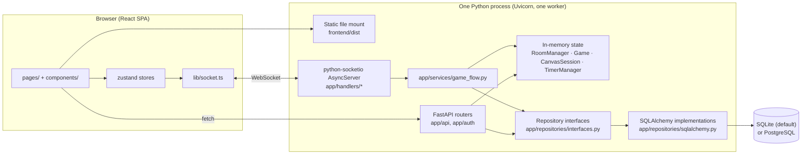

# Architecture

Sketchy is an online multiplayer drawing-and-guessing game. This document describes
how the running system is put together: the processes, the layers inside them, who
owns which state, and where a change to one of them forces a change somewhere else.

Companion documents:

- [`wire-protocol.md`](wire-protocol.md) — the exact Socket.IO and REST contract between the two halves.
- [`database.md`](database.md) — every table, its columns, and the flows that write them.
- [`requirements.md`](requirements.md) — what the system is required to do, and what it deliberately does not do.
- [`ui-mockups/`](ui-mockups/) — an artboard per screen, matched to the shipped styles, plus the redesign rationale. What the frontend described here actually looks like.
- [`../GLOSSARY.md`](../GLOSSARY.md) — the one agreed name per concept. Read it before naming anything a player can see.
- [`../README.md`](../README.md) — the operator- and player-facing narrative; this document is the structural one.

---

## 1. Shape of the system

Two deployable artifacts, normally served from one port:

| Artifact | Language | Entry point |
| --- | --- | --- |
| Backend | Python 3.14 | [`backend/app/server.py`](../backend/app/server.py) → [`backend/app/main.py`](../backend/app/main.py) |
| Frontend | TypeScript / React 19 | [`frontend/src/main.tsx`](../frontend/src/main.tsx) → [`frontend/src/App.tsx`](../frontend/src/App.tsx) |



`app = socketio.ASGIApp(sio, other_asgi_app=api, socketio_path="socket.io")`
([`backend/app/main.py:266`](../backend/app/main.py)) is the single ASGI application:
Socket.IO owns `/socket.io`, FastAPI owns everything else, and when
`frontend/dist` exists it is mounted as static files on the same app. That is what
makes single-port self-hosting and same-origin cookie sessions work without CORS
credentials or CSRF tokens.

### The single-worker rule

**v1 supports exactly one application worker.** Live rooms, games, canvases, timers,
Socket.IO sessions, and room-code lookup are process-owned. Startup rejects
`WEB_CONCURRENCY`/`UVICORN_WORKERS` values other than `1`
([`backend/app/deployment.py`](../backend/app/deployment.py)). A second worker would split one
logical service into inconsistent islands; shared PostgreSQL state does not change
that, and a Socket.IO message queue alone would not make multi-worker gameplay
correct.

Everything else in this document follows from that decision: in-process counters are
the true counters, a room-code reservation table exists to be race-safe *anyway*, and
horizontal scaling is an explicit non-goal rather than an undiscovered mode.

---

## 2. Backend layering

The backend is deliberately layered so that the interesting logic is pure and
unit-testable, and the I/O is thin.

```
app/server.py         Uvicorn runner with a draining shutdown
app/main.py           ASGI assembly: FastAPI + Socket.IO + static + lifespan
├── app/api/          REST routers (profiles, prompt lists, moderation, operations, …)
├── app/auth/         Accounts, sessions, email, moderation primitives, CLI commands
├── app/handlers/     Socket.IO transport adapters, one module per domain
│   └── payloads.py   Typed, strict validation of every client-originated command
├── app/services/     Cross-domain workflows and background loops
│   └── game_flow.py  The turn/round/timer/player-removal orchestration
├── app/presenters.py Pure construction of outgoing payloads
├── app/game.py       Pure game state machine — no I/O
├── app/rooms.py      In-memory Room/Player/RoomManager domain model
├── app/canvas_*.py   Canvas history, per-turn session, durable storage policy
├── app/live_drawing.py  Binary live-drawing frame codec
├── app/repositories/ Abstract interfaces + SQLAlchemy implementations
└── app/db/           SQLAlchemy models, engine setup, seeding, migration runner
```

### Layer responsibilities

**`app/game.py` — the pure state machine.**
`Game` owns phases, the turn rotation, prompt choice, hint economics, guess matching,
and scoring. It performs no I/O and touches no socket. `Phase` is
`choosing_prompt | drawing | turn_results | game_end`
([`backend/app/game.py:139`](../backend/app/game.py)). Scoring constants and the
versioned rule snapshot live here
([`backend/app/game.py:38`](../backend/app/game.py),
[`backend/app/game.py:370`](../backend/app/game.py)). This is the module to change when
game rules change — and changing an outcome-producing constant requires bumping
`SCORING_RULES_VERSION`.

**`app/rooms.py` — the live room model.**
`Room`, `Player`, `RestartVote`, `DrawingRecapEntry`, and `RoomManager`. A `Room`
outlives the `Game`s played in it. `RoomManager` is the process-wide registry, held
as a singleton in [`backend/app/state.py`](../backend/app/state.py) so REST routes and
Socket.IO handlers see the same rooms. Room settings, the recap buffer, and the
resolved prompt pool live here; `to_state_payload()`
([`backend/app/rooms.py:511`](../backend/app/rooms.py)) and `to_public_summary()`
([`backend/app/rooms.py:483`](../backend/app/rooms.py)) are the two shapes the room is
published in.

**`app/handlers/*` — transport adapters, nothing more.**
Each module registers its events at the bottom in a `register(ctx)` function and does
the same four things in order: parse the payload, resolve the caller, authorize, then
delegate. `HandlerContext`
([`backend/app/handlers/context.py`](../backend/app/handlers/context.py)) carries the
`sio` server, the `RoomManager`, timers, repositories, the session factory, and the
optional services. Handler domains:

| Module | Owns |
| --- | --- |
| [`connection.py`](../backend/app/handlers/connection.py) | `connect`/`disconnect`, cookie→account binding, the 30-second reconnect grace, reconciling every seat a dropped socket still held |
| [`rooms.py`](../backend/app/handlers/rooms.py) | Create/join/leave, settings, previews, renames, colorblind suggestion |
| [`game.py`](../backend/app/handlers/game.py) | `start_game`, `select_prompt` |
| [`drawing.py`](../backend/app/handlers/drawing.py) | `draw`, `undo_stroke`, `request_sync_strokes` |
| [`chat.py`](../backend/app/handlers/chat.py) | `send_chat`, `guess`, `buy_hint`, `buy_wheel_letter` |
| [`moderation.py`](../backend/app/handlers/moderation.py) | `toggle_afk`, `vote_player`, `report_player` |
| [`restart.py`](../backend/app/handlers/restart.py) | `propose_restart_vote`, `cast_restart_vote` |
| [`identity.py`](../backend/app/handlers/identity.py) | Resolving the account behind a socket into the name/color it plays under |
| [`sessions.py`](../backend/app/handlers/sessions.py) | Socket session resolution shared by handler domains |
| [`payloads.py`](../backend/app/handlers/payloads.py) | Strict typed validation for every inbound command |

**`app/services/game_flow.py` — the orchestrator.**
Anything that spans domains lives here: starting turns, ending turns, scheduling
phase and hint timers, removing a player from a running game, emitting canvas sync
and commit events, and persisting a finished game. When a handler needs to do more
than answer its own caller, it calls `GameFlowService`.

**`app/presenters.py` — pure payload construction.**
`room_state_payload`, `turn_payload`, `turn_ended_payload`, `session_payload`,
`system_chat_message`. Keeping these pure means the exact bytes a client sees are
unit-testable without a socket.

**`app/repositories/` — the persistence boundary.**
`interfaces.py` declares abstract `UserRepository`, `GameHistoryRepository`, and
`PromptListRepository` plus the input/output dataclasses that cross the boundary.
`sqlalchemy.py` implements them. Handlers and routers depend on the interfaces, never
on SQLAlchemy models directly. Services that are inherently relational (moderation,
runtime metrics, room presets, user settings, blocks) take an
`async_sessionmaker` instead — a deliberate exception where a repository abstraction
would only add indirection.

### The canvas subsystem

Three modules with three different commitments, and they must not be conflated:

| Module | Commitment |
| --- | --- |
| [`live_drawing.py`](../backend/app/live_drawing.py) | The **wire** format for one live action. Both ends deploy together, so a version bump is coordinated by definition. |
| [`canvas_history.py`](../backend/app/canvas_history.py) | The **in-memory** packed representation plus the versioned replay envelope (`SKCH`). |
| [`canvas_storage.py`](../backend/app/canvas_storage.py) | The **durable** format policy. Every format ever written keeps its decoder forever; decoders answer in the current wire format. |

`canvas_session.py` holds the per-turn protocol state: generation, sequence,
revision, rolling history hash, the acknowledgement window, and the replay-work
budget. Details of all of this are in [`wire-protocol.md`](wire-protocol.md).

---

## 3. Frontend layering

```
frontend/src/
├── main.tsx, App.tsx      Router, identity bootstrap, socket connection
├── pages/                 One component per route
├── components/            Canvas, toolbar, player list, dialogs, overlays
├── hooks/
│   ├── useGameSocketListeners.ts  Every server→client listener, registered once
│   ├── useCanvasProtocol.ts       Client half of the canvas sequencing protocol
│   └── useCanvasPointerInput.ts   Pointer → drawing action translation
├── store/
│   ├── gameStore.ts       Live room/game state
│   ├── authStore.ts       Account identity and role
│   ├── settingsStore.ts   Player settings (+ settingsMigrations.ts)
│   └── canvasBudgetStore.ts  Client-side replay-work budget
├── lib/                   Pure helpers, one concern per file; socket.ts is the singleton
├── types.ts               Shared TypeScript types for every socket payload
└── styles/                CSS, one file per surface
```

Routes ([`frontend/src/App.tsx:103`](../frontend/src/App.tsx)):

| Path | Page |
| --- | --- |
| `/` | [`LobbyBrowserPage`](../frontend/src/pages/LobbyBrowserPage.tsx) |
| `/create` | [`CreateRoomPage`](../frontend/src/pages/CreateRoomPage.tsx) |
| `/room/:code` | [`GameRoomPage`](../frontend/src/pages/GameRoomPage.tsx) |
| `/prompt-lists`, `/prompt-lists/:slug` | [`PromptStatsPage`](../frontend/src/pages/PromptStatsPage.tsx) |
| `/my-prompt-lists` | [`MyPromptListsPage`](../frontend/src/pages/MyPromptListsPage.tsx) |
| `/profile`, `/profile/:userId` | [`ProfilePage`](../frontend/src/pages/ProfilePage.tsx) |
| `/forgot-password`, `/reset-password`, `/verify-email` | [`AccountRecoveryPage`](../frontend/src/pages/AccountRecoveryPage.tsx) |
| `/admin/operations` | [`AdminOperationsPage`](../frontend/src/pages/AdminOperationsPage.tsx) |
| `/moderation` | [`ModerationPage`](../frontend/src/pages/ModerationPage.tsx) |
| `/admin/bug-reports` | [`BugReportsPage`](../frontend/src/pages/BugReportsPage.tsx) |

Two frontend conventions worth knowing:

1. **`autoConnect` is off** ([`frontend/src/lib/socket.ts:13`](../frontend/src/lib/socket.ts)).
   The handshake reads the session cookie exactly once, and on a first visit that
   cookie does not exist until `GET /api/auth/me` has provisioned the account.
   `App.tsx` connects only once identity has settled.
2. **`emitWithAck` never hands a packet to a disconnected socket**
   ([`frontend/src/lib/socket.ts:139`](../frontend/src/lib/socket.ts)). Socket.IO would
   queue it and deliver it on reconnect, so a request reported as failed could arrive
   seconds later — a second room, or a game started twice. Actions that only make
   sense in the moment (a vote, leaving, toggling AFK) are dropped outright rather than
   replayed. A guess is dropped the same way but *confirmed*: it is resent once if the
   server does not acknowledge it, and carries an id so the resend cannot be processed
   twice (`wire-protocol.md` §2).

---

## 4. State ownership

This is the table to consult before adding a feature: *where does this state live?*

| State | Owner | Survives restart? |
| --- | --- | --- |
| Live rooms, players, seats, scores-in-progress | `RoomManager` (memory) | No |
| Active `Game`, phase, deadlines, prompt choice, hint spend | `Game` (memory) | No |
| Canvas history, generation, sequence, replay budget | `CanvasSession` (memory) | No |
| Phase/hint/restart/disconnect timers | `TimerManager` (memory) | No |
| Drawing recap for the last game in a room | `Room.drawing_recaps` (memory) | No |
| Prompt-list share codes borrowed into a room | `Room` (memory only, never logged or published) | No |
| Quick custom prompts typed into a room | `Room` (memory) | No |
| Accounts, sessions, roles, bans, blocks | Database | Yes |
| Finished game history, turns, outcomes, score ledger, drawings | Database | Yes |
| Prompt concepts, versions, aliases, lists, revisions, usage facts | Database | Yes |
| Room-setting presets | Database | Yes |
| Room-code reservations (including retirement) | Database | Yes |
| Retained messages (30 days) and pinned report evidence | Database | Yes |
| Runtime observations (30 days) and permanent daily roll-ups | Database | Yes |
| Live counts of rooms/players/games | In-process counters | No, deliberately |

The boundary is a rule, not an accident: **durable configuration and durable
correlation IDs never make an active game recoverable.** Nothing reopens a live room:
when its last player leaves, the room and everything in it are gone.

---

## 5. Request paths

### Gameplay (WebSocket)

```
client emit ──▶ sio.on(event)  handlers/<domain>.py
                    │
                    ├─ parse_payload(Model, data)      handlers/payloads.py   (strict, bounded)
                    ├─ require_current_player(sid)     services/game_flow.py  (identity + stale-socket rejection)
                    ├─ authorize (host? drawer? phase? role?)
                    ├─ mutate Room / Game / CanvasSession
                    ├─ emit broadcasts (presenters.py builds the payloads)
                    └─ return the acknowledgement dict
```

Validation completes **before** authorization or mutation, and values are never
coerced: strings and booleans must have their JSON types, integers must be integers
and not booleans, and unknown fields are rejected
([`backend/app/handlers/payloads.py:78`](../backend/app/handlers/payloads.py)).

### Data queries (REST)

```
fetch ──▶ SessionAuthMiddleware  (app/auth/middleware.py: resolves the hashed cookie)
      ──▶ FastAPI router          (app/api/*, app/auth/routes.py)
      ──▶ repository or session
      ──▶ serializer              (app/api/serializers.py)
```

REST is used for health/readiness, room discovery, and everything that is a *query or
an account action* rather than gameplay. Socket.IO handshakes resolve the same
revocable session record as HTTP requests
([`backend/app/handlers/connection.py:22`](../backend/app/handlers/connection.py)), so
revocation applies uniformly without a shared signing secret.

---

## 6. Lifecycle

### Startup ([`backend/app/main.py:170`](../backend/app/main.py))

1. `configure_logging()`
2. `validate_python_runtime()` — refuses an interpreter older than 3.14
3. `validate_worker_topology()` — refuses a multi-worker configuration
4. `init_db()` — SQLite runs Alembic automatically; PostgreSQL *verifies* the revision and fails with a direct instruction if the deploy step was skipped
5. `retire_orphaned_ephemeral()` — room codes left claimed by a crash
6. `purge_expired_room_messages()` and `purge_expired_shutdown_abandonments()`
7. `seed_prompt_lists()` — identity-based, and a conflicting redeploy fails startup
8. Start the mail-delivery loop and the runtime-metrics flush loop
9. `mark_ready()` — `GET /api/ready` starts answering 200

### Planned shutdown ([`backend/app/services/shutdown.py`](../backend/app/services/shutdown.py))

`GET /api/ready` flips to 503 **before** drain work begins. The server then emits the
versioned `server_shutdown` notice to every connected client, refuses new room
creation, new game starts, and restart votes, but
leaves existing rooms connected so active games can finish. `SHUTDOWN_DRAIN_SECONDS`
(0–300, default 30) bounds the window.

A game that finishes inside the window follows the ordinary all-or-nothing history
path. A game still live when the deadline expires is **not** misrepresented as
finished: one privacy-safe `planned_shutdown_abandonments` row is written instead
(runtime IDs, phase, counts, timestamps — never room codes, names, prompts, chat, or
canvas contents). A second termination signal abandons the rest of the window and
skips even that diagnostic. A hard crash cannot run this hook at all.

---

## 7. Cross-cutting concerns

### Identity and sessions

Every visitor is provisioned an anonymous account on first page load and remembered
by an HttpOnly `sketchy_session` cookie. Session cookies carry opaque 256-bit random
tokens; only SHA-256 hashes are stored. Tokens rotate halfway through a one-year
maximum lifetime. Registered players can inspect and revoke individual devices.
Logging in while carrying a guest identity creates an **immutable alias**
(`identity_aliases`) rather than rewriting the guest's historical seats.

Merely opening a socket never creates a user row, and neither does merely loading the
page: **choosing a name is what provisions a guest**
([`POST /api/auth/display-name`](../backend/app/auth/routes.py)). `GET /api/auth/me` creates
nothing, because it runs on every page load including ones nobody is behind — a
crawler, a link preview, an uptime check — and each of those used to cost a `users` row
and an `auth_sessions` row. It still writes for a caller who *has* an account (recording
activity, rotating a due session); the rule is about creation, which is the part an
anonymous flood can force. Provisioning is bounded per address and by a process-wide
daily ceiling, and stale guest rows are purged by a loop the application starts itself.

The socket resolves its account once, at the handshake, so a visitor who names
themselves after connecting re-handshakes rather than spending that connection
anonymous ([`frontend/src/lib/socket.ts`](../frontend/src/lib/socket.ts)).

### Seats and sockets

**One socket holds at most one seat.** Creating or joining a room first releases
whatever seat that connection already held, by the same path an explicit `leave_room`
takes — the old room re-emits its state, drops its timers, loses the socket from its
Socket.IO room, and, if that was its last player, is torn down and its invite code
retired (`GameFlowService.release_seat`,
[`backend/app/services/game_flow.py`](../backend/app/services/game_flow.py)). Nothing
else reclaims an abandoned seat: it keeps `connected` and the live `sid`, which is
enough to stop its room ever counting as empty.

Every transition that takes, moves, or gives up a seat runs under that socket's
**seating gate** — a per-`sid` lock on `HandlerContext`
([`backend/app/handlers/context.py`](../backend/app/handlers/context.py)). Socket.IO
dispatches each event from a connection as its own task, so without it a second
`create_room` runs while the first is still waiting on the database. The disconnect
queues at the same gate, which is what makes a socket that drops mid-entry reconcile
against a seat that exists rather than a moment before it does.

A disconnect **this server issued** is the exception and must stay one. Closing the tab
a reconnect superseded runs that socket's disconnect handler inline, from inside the
transition that closed it — the seat has already moved on, and waiting at its gate
would be waiting for the caller. Two tabs of one account reaching the same seat at the
same moment would then wait for each other for ever. `HandlerContext.closing` marks
the socket for the length of the close and `disconnect` asks it, rather than reading
the framework's disconnect reason: whether this deadlocks should not depend on how a
dependency passes an argument.

Seats are matched **by `sid`, never by account**: two tabs of one account sitting in
two different rooms is ordinary, and only the connection that is moving is moved.

### Room ceilings

Creating a room is the only ordinary socket command that allocates unbounded process
memory — a `Room`, its `CanvasSession`, its recap buffer, its quick prompts — and
claims a durable code reservation, on a server where one process owns all of it.
`RoomQuotaService`
([`backend/app/services/room_quotas.py`](../backend/app/services/room_quotas.py))
answers four questions before one is opened: how many rooms this account already
holds, how often it has opened one this hour, how many rooms exist at all, and how
many quick-prompt characters the live rooms are holding together. The account ones
are answered from memory; the rate uses the same persistent bucket the authentication
limits use, so a restart is not a fresh allowance.

**Creating requires an account; joining does not.** A visitor whose browser keeps no
cookie still plays and still receives a factual history seat (R-HIST-10) — they simply
cannot host, because a ceiling with nothing to key on is not a ceiling.

The capacity check runs twice: once when the command arrives, and again in the last
instant before the room exists, where no await separates the answer from the room. A
refusal at that second point releases the code reservation the attempt had already
claimed, the same way the drain checks above it do, and gives back the hourly
allowance it had already spent.

`RoomCapacityService` answers the other half: how much of the server one room, or
one socket, may occupy. Eight spectators per room (independently of `max_players`,
so a two-player room cannot become a thirty-seat broadcast), six hundred sockets per
process, twenty seating joins per socket per minute, and twenty rebinds of any one
seat to a new socket per minute — that last keyed by the seat, because a per-socket key
cannot see the churn: every attempt arrives on a new socket with a fresh allowance and
the socket it supersedes is closed, so the connection ceiling never notices either. A
socket past the ceiling is
**told and then closed** rather than refused — `ConnectionRefusedError` is reserved for
suspensions — and the open sockets are held as a set of sids rather than a count,
because a count is only ever as right as the last event that moved it. The set is
balanced in a `finally`: a handshake refused with `ConnectionRefusedError` never
reaches the disconnect handler, because Socket.IO answers it with `CONNECT_ERROR` and
tears the session down itself, so a suspended account could otherwise fill the ceiling
with sockets that were never open.

Those ceilings are also what bounds the join fan-out. A room holds at most 24 seats, so
the room-state broadcast every join triggers is bounded rather than quadratic in an
attacker's patience; what remained was the payload's own quadratic term, and the kick
and AFK vote lists are now carried only where somebody has actually voted.

Every client command answers to a **per-caller budget** before it is parsed
([`backend/app/handlers/budgets.py`](../backend/app/handlers/budgets.py)), registered
through `HandlerContext.on` so that adding a command cannot quietly add an unbounded
one — `test_command_budgets.py` checks the two lists against each other. The numbers
follow the client's own cadence rather than the size of the host: the drawer's flush
timer fires every 40 ms, so drawing is allowed double the 25 frames a second that
produces, while `request_sync_strokes` — a cheap request with a full canvas re-encode
for an answer — gets a floor instead of a ceiling. Windows live in memory and are
dropped when the socket goes.

They are grouped into five classes rather than set per command, and held in a policy
object carrying each one's default, bounds and purpose — never read from the
environment, because [#446](https://github.com/sephirothx/sketchy/issues/446) tunes
values like these from an admin panel without a deploy, and a value fixed at startup
forecloses that. Windows are keyed by class, not by command, so two commands of one kind share the
allowance that kind was given. A refused `draw` frame drops silently, since nobody
awaits an answer to one and an error mid-stroke is worse than the frame it describes;
everything a person pressed a control for answers instead — including `undo_stroke`,
which shares drawing's budget but is sent with an acknowledgement waiting on it. Exhaustion is recorded once per window, which
is what separates a mistake from a flood without writing a row per refusal.

Per-**address** ceilings are deliberately absent. Behind the reverse proxy #457
introduces, every socket presents the proxy's address, and the forwarded header is
attacker-controlled — `auth/rate_limit.client_key` refuses to read it for exactly that
reason. The key arrives when an address worth keying on does.

### Authorization

Two independent axes:

- **Account role** (`user | moderator | admin`) is service-wide. The account payload
  carries the role so the account menu knows what to *show*; every endpoint behind
  those entries re-checks the role itself and answers **404** to anyone else.
- **Room host** is an ordinary gameplay role and never implies any service privilege.

### Timers

`TimerManager` ([`backend/app/services/timers.py`](../backend/app/services/timers.py))
owns every asyncio timer task: phase deadlines, hint checkpoints, restart-vote
expiry, and the per-player reconnect grace. Application-owned rather than scattered
`create_task` calls, so teardown is a single `close()` and a room removal cannot leak
a task that fires into a room that no longer exists.

### Naming and the wire contract

Nothing in either language checks that the two sides agree on a name — a payload key
is a plain string in Python and a plain property in TypeScript, so a half-finished
rename compiles, lints, and passes every other test while the feature silently stops
working. [`backend/tests/test_wire_contract.py`](../backend/tests/test_wire_contract.py)
pins the four things they must agree on by reading both trees as text: the events each
direction sends, the camelCase keys the server puts in payloads, and the field names
its command parsers accept. It also rejects wire names built from vocabulary
[`GLOSSARY.md`](../GLOSSARY.md) retired.

**Renaming is fine; renaming half of one is not.**

### Observability

Two things are recorded, answering two different questions
([`backend/app/services/runtime_metrics.py`](../backend/app/services/runtime_metrics.py)):

- **Live counts** of rooms, players, and running games are in memory, because one
  worker owns all of it and an in-process count is therefore the true count. They are
  meant to vanish on restart.
- **Observations** (joins, disconnects, evictions after grace, games started/finished/
  abandoned, timer overruns past 250 ms, stored drawing sizes, recap-budget drops,
  callers held to a command budget) are
  buffered and written in batches, because a database round trip per join would be felt
  as lag inside a drawing. The buffer is bounded, drops oldest when full, and counts
  what it dropped so a gap is visible rather than silent.

Raw observations are kept 30 days and rolled into permanent daily totals first.
Operators read this through `GET /metrics` (Prometheus text, bearer token, disabled
until `METRICS_TOKEN` is set) or `/admin/operations` in the app. The per-player view
there is a surveillance surface on the game's own players, so **every use writes an
audit event naming both who looked and who was looked at.**

---

## 8. Data-flow walkthroughs

### A turn, end to end

```
host: start_game
  └─ handlers/game.py  →  GameFlowService._start_turn
       ├─ Room.allocate_canvas_generation()          new CanvasSession generation
       ├─ emit canvas_reset      [revision, generation, sequence, hash]   → room
       ├─ emit turn_starting     {drawerId, roundNumber, seconds, …}      → room
       ├─ emit your_prompt_choices {choices, seconds}                     → drawer only
       └─ schedule the CHOOSE_PROMPT_SECONDS (15s) phase timer

drawer: select_prompt  (or the timer forces a choice)
  └─ GameFlowService._begin_drawing
       ├─ Game.snapshot_turn_participants(...)       freezes eligibility, per seat
       ├─ emit turn_started {maskedPrompt, hintCost, letterPrices, …}     → per socket
       └─ schedule the drawing timer + hint checkpoints

drawer: draw / undo_stroke      (binary; see wire-protocol.md)
  └─ handlers/drawing.py  →  CanvasSession.record_stroke / undo_last_stroke
       ├─ rebroadcast the exact wire frame to the room (skip_sid=drawer),
       │  with the commit attached when that frame commits an action
       ├─ emit canvas_commit                                → the drawer alone
       └─ emit canvas_undo                                               → room

guessers: guess          (volatile, acknowledged; a retry carrying a seen id stops here)
  └─ handlers/chat.py  →  Game.submit_guess
       ├─ correct  → emit correct_guess (room) + you_guessed_correctly (guesser)
       ├─ near miss→ emit chat_message twice, drawer-safe, to the guesser only
       └─ wrong    → emit chat_message                                    → room

turn ends (all eligible guessed, or the timer fires)
  └─ GameFlowService._end_turn
       ├─ Game.end_turn(...) → drawer bonus, CompletedTurnStats
       ├─ Room.record_drawing_recap(entry)           bounded by MAX_RECAP_CANVAS_BYTES
       ├─ emit turn_ended {prompt, drawerBonus, guesses, scores}          → room
       └─ next turn, or the game ends
```

### A finished game becoming history

`GameFlowService._persist_game_history` runs **after** every client-visible emit, so
nothing a player is waiting to see sits behind a database round trip. The write is
all-or-nothing and keyed on the game's stable UUIDv7:

- Retrying the same ID with the same content is idempotent, even if collection order
  changed (a canonical SHA-256 payload digest proves it).
- Reusing an ID for *different* content raises an operator-visible conflict instead
  of duplicating or silently replacing history.
- In the same transaction: the game record, participants, turns, per-seat outcomes,
  prompt offers and their sources, guesses, the score-event ledger, the turn drawings,
  the prompt-usage facts, and the daily user-stat projection increments.
- The ledger is *proved* against the cached scores: every participant's signed deltas
  must sum to their final score, in that transaction, or the write fails.

Full table-by-table detail is in [`database.md`](database.md).

### Reconnection

On disconnect, the player keeps their seat for `RECONNECT_GRACE_SECONDS` (30)
([`backend/app/handlers/connection.py:20`](../backend/app/handlers/connection.py)). A
successful reconnect replaces the player's active socket so the superseded socket can
no longer issue commands (`session_superseded`). If the grace expires, the seat is
evicted, a `player.evicted` observation is recorded, and — if the drawer was the one
who left — their turn is skipped and they leave the rotation. If everyone
disconnects, the room is torn down and, if a game was live, an `abandoned` game record
is written.

The disconnect reconciles against **every seat the socket actually holds**
(`RoomManager.seats_for_sid`), not the single room its session names. One session key
cannot describe a socket that ever ended up in two rooms, so a seat stranded by an
older build is still found and still becomes disconnected.

---

## 9. Testing architecture

| Suite | Location | What it proves |
| --- | --- | --- |
| Domain unit tests | `backend/tests/test_game.py`, `test_rooms.py`, … | The pure logic, with no sockets |
| Handler integration | `backend/tests/handlers/` | One asyncio suite per Socket.IO domain |
| Payload/protocol | `test_payloads.py`, `test_canvas_history.py`, `test_live_drawing.py` | The exact wire shapes and their refusals |
| Wire contract | `test_wire_contract.py` | Both sides still agree on every name |
| Database | `test_db_models.py`, `test_migrations.py`, `test_repositories.py` | Schema, the full migration chain both directions, drift, and the repositories against PostgreSQL |
| E2E | `backend/tests/e2e/` | Real multi-browser Playwright sessions across Chromium and Firefox |
| Benchmarks | `benchmarks/`, `frontend/benchmarks/` | Diagnostic baselines, deliberately **not** CI thresholds |
| Repository hygiene | `backend/tests/test_repo_artifacts.py` | No database, env file, or private key is tracked - by name or by bytes |

Two rules keep the E2E suite fast: a test waits on the condition it actually cares
about (never a fixed sleep sized to outlast it), and where it genuinely must sit out a
production interval it fast-forwards the page's own clock with Playwright's
`page.clock` rather than spending the time — which keeps the interval a production
constant instead of something bent for the tests.

CI ([`.github/workflows/ci.yml`](../.github/workflows/ci.yml)) runs five jobs: the
repository artifact scan, backend lint and tests, PostgreSQL migrations and
repositories, frontend test/lint/build, and the multi-browser E2E suite.

The artifact scan
([`scripts/check-tracked-artifacts.sh`](../scripts/check-tracked-artifacts.sh)) is the
one job that guards the repository rather than the program. A database has reached a
commit twice - a write-ahead log, then a whole database with a signing secret in it,
pushed to a public remote - because `.gitignore` only ever matched the filename shapes
someone had already thought of. So the scan refuses a file for its *bytes* as well as
its name - a SQLite header or PEM private-key armour, under any filename, and [`.githooks/pre-push`](../.githooks/pre-push) runs the same script over a
push range for anyone who opts in with `git config core.hooksPath .githooks`. Catching
it locally matters more than catching it in CI: by the time CI speaks, a secret is
already public.

---

## 10. Key architectural decisions

| Decision | Why | Consequence |
| --- | --- | --- |
| Durable persistence, in-memory gameplay | Minimum latency for drawing; zero-config default | An active game is never recoverable; a crash loses live state |
| Exactly one application worker | Process-owned rooms/timers/canvases | An explicit product ceiling (50 rooms / 400 seats), not an undiscovered scaling mode |
| Bounded drain, no live snapshots | Deploys should not kill games mid-turn | A leftover game gets a 90-day privacy-safe abandonment fact, never a fake "finished" |
| Versioned hybrid drawing protocol | Compact binary for data-bearing actions; a bare byte for control frames | The server validates and refuses before recording or rebroadcasting |
| Separate wire and stored canvas formats | The wire has one live peer; storage has every future decoder | The wire format stays free to change without migrating a single row |
| Repository interfaces over ORM models | Handlers stay testable and swappable | Relational-by-nature services take a session factory instead, on purpose |
| Identity-based prompt seeding | Text is not identity; a reword must not orphan statistics | Redeploying different content under a seen ID fails startup |
| Facts, not counters | Ratings/seasons/achievements are a later product decision | Derived rows (the daily projection) are disposable and rebuildable |

---

## 11. Where to change what

| If you are changing… | Start here | Then check |
| --- | --- | --- |
| A game rule or a scoring constant | [`backend/app/game.py`](../backend/app/game.py) | Bump `SCORING_RULES_VERSION`; update `rule_snapshot()`; [`requirements.md`](requirements.md) §Scoring |
| A room setting | [`backend/app/rooms.py`](../backend/app/rooms.py), [`payloads.py`](../backend/app/handlers/payloads.py) | `to_state_payload`, `editable_room_settings_payload`, `frontend/src/types.ts`, preset columns, [`database.md`](database.md) |
| A Socket.IO event or payload key | the handler + [`frontend/src/types.ts`](../frontend/src/types.ts) | `test_wire_contract.py`, [`wire-protocol.md`](wire-protocol.md) |
| The drawing wire format | [`live_drawing.py`](../backend/app/live_drawing.py) | `canvas_history.py`, `useCanvasProtocol.ts`, `fixtures/canvas_protocol_v1.json`, [`wire-protocol.md`](wire-protocol.md) |
| The stored drawing format | [`canvas_storage.py`](../backend/app/canvas_storage.py) | Add a decoder entry; **never remove one** |
| A table or column | [`backend/app/db/models.py`](../backend/app/db/models.py) | A new Alembic migration, `test_migrations.py`, [`database.md`](database.md) |
| A player-visible name | [`GLOSSARY.md`](../GLOSSARY.md) | Rename on both sides in one change |
| An enum backed by a `CHECK` | [`domain_values.py`](../backend/app/domain_values.py) | Coordinated code + migration + contract + README + glossary review |

---

## 12. Module index

Every backend module, by its own one-line docstring. This is the fastest way to find
where something lives; regenerate it with:

```bash
python3 -c "import ast,glob;[print(p,'|',(ast.get_docstring(ast.parse(open(p).read())) or '').split(chr(10))[0]) for p in sorted(glob.glob('backend/app/**/*.py',recursive=True))]"
```

| Module | Purpose |
| --- | --- |
| [`app/api/__init__.py`](../backend/app/api/__init__.py) | REST routers served alongside the Socket.IO application. |
| [`app/api/bug_reports.py`](../backend/app/api/bug_reports.py) | Player-filed bug reports and the administrator queue that triages them. |
| [`app/request_limits.py`](../backend/app/request_limits.py) | The ceiling on request bodies, applied before anything reads one. |
| [`app/api/moderation.py`](../backend/app/api/moderation.py) | Player reports and role-gated moderation actions. |
| [`app/api/operations.py`](../backend/app/api/operations.py) | Operator-facing views of how the server is behaving. |
| [`app/api/profiles.py`](../backend/app/api/profiles.py) | Public profile endpoints: lifetime stats and browsable game history. |
| [`app/api/prompt_lists.py`](../backend/app/api/prompt_lists.py) | Prompt list discovery, and the usage statistics the games feed back into it. |
| [`app/api/room_presets.py`](../backend/app/api/room_presets.py) | Authenticated CRUD API for private reusable room-setting presets. |
| [`app/api/serializers.py`](../backend/app/api/serializers.py) | Shared JSON shapes for the REST surface. |
| [`app/api/user_blocks.py`](../backend/app/api/user_blocks.py) | Persistent block, unblock, and block-list endpoints. |
| [`app/api/user_settings.py`](../backend/app/api/user_settings.py) | Registered-account preferences shared across devices. |
| [`app/auth/__init__.py`](../backend/app/auth/__init__.py) | Opaque session identity, password hashing, and request authentication. |
| [`app/auth/account_data.py`](../backend/app/auth/account_data.py) | Versioned account exports and history-safe account anonymization. |
| [`app/auth/admin.py`](../backend/app/auth/admin.py) | Audited command for bootstrapping the first service administrator. |
| [`app/auth/audit.py`](../backend/app/auth/audit.py) | Privacy-safe request correlation for append-only audit events. |
| [`app/auth/avatars.py`](../backend/app/auth/avatars.py) | Canonical keys for avatar visuals hosted by the Sketchy deployment. |
| [`app/auth/bans.py`](../backend/app/auth/bans.py) | Shared active-ban queries for HTTP, Socket.IO, login, and moderation. |
| [`app/auth/blocks.py`](../backend/app/auth/blocks.py) | Low-latency lookup cache for directional player blocks. |
| [`app/auth/email.py`](../backend/app/auth/email.py) | Provider-agnostic normalization for account email identities. |
| [`app/auth/mail.py`](../backend/app/auth/mail.py) | Queueing and delivery for the few messages this game ever sends. |
| [`app/auth/middleware.py`](../backend/app/auth/middleware.py) | Session cookie plumbing for HTTP requests and Socket.IO handshakes. |
| [`app/auth/names.py`](../backend/app/auth/names.py) | The single naming rule shared by guest nicknames and account usernames. |
| [`app/auth/password.py`](../backend/app/auth/password.py) | Argon2id password hashing, kept off the event loop. |
| [`app/auth/password_reset.py`](../backend/app/auth/password_reset.py) | Operator-run password reset, for deployments that cannot send mail. |
| [`app/auth/rate_limit.py`](../backend/app/auth/rate_limit.py) | Local low-risk and persistent security-sensitive request rate limits. |
| [`app/auth/recovery.py`](../backend/app/auth/recovery.py) | Getting back into an account whose password is gone. |
| [`app/auth/retention.py`](../backend/app/auth/retention.py) | Bounded cleanup policy for stale anonymous account rows. |
| [`app/auth/routes.py`](../backend/app/auth/routes.py) | REST endpoints for anonymous provisioning, registration, and sign-in. |
| [`app/auth/sessions.py`](../backend/app/auth/sessions.py) | Opaque, hashed, server-side account session lifecycle. |
| [`app/auth/tokens.py`](../backend/app/auth/tokens.py) | One-shot tokens for flows that leave the app and come back. |
| [`app/canvas_history.py`](../backend/app/canvas_history.py) | Compact, versioned drawing-history models and wire encoding. |
| [`app/canvas_session.py`](../backend/app/canvas_session.py) | Per-turn canvas protocol state and drawing-history operations. |
| [`app/canvas_storage.py`](../backend/app/canvas_storage.py) | Durable storage policy for finished drawings. |
| [`app/db/__init__.py`](../backend/app/db/__init__.py) | Database engine, session management, and lifecycle initialization. |
| [`app/db/migrate.py`](../backend/app/db/migrate.py) | Deployment entry point for applying database migrations safely. |
| [`app/db/models.py`](../backend/app/db/models.py) | SQLAlchemy ORM models for Sketchy database tables. |
| [`app/db/types.py`](../backend/app/db/types.py) | Database types that normalize dialect differences at persistence boundaries. |
| [`app/deployment.py`](../backend/app/deployment.py) | Deployment invariants that must fail before application startup mutates state. |
| [`app/domain_values.py`](../backend/app/domain_values.py) | Canonical stored values shared by validation, domain logic, and schema. |
| [`app/drawing_rules.py`](../backend/app/drawing_rules.py) | A room's drawing rules: which tools and which colors a drawer may use. |
| [`app/game.py`](../backend/app/game.py) | Per-room game state machine: turn rotation, prompt choice, drawing timer, scoring. |
| [`app/handlers/__init__.py`](../backend/app/handlers/__init__.py) | Wire all Socket.IO handler domains onto a server. |
| [`app/handlers/chat.py`](../backend/app/handlers/chat.py) | Socket.IO handlers for the chat domain. |
| [`app/handlers/connection.py`](../backend/app/handlers/connection.py) | Socket.IO handlers for the connection domain. |
| [`app/handlers/context.py`](../backend/app/handlers/context.py) | Shared dependencies passed to every Socket.IO handler domain. |
| [`app/handlers/drawing.py`](../backend/app/handlers/drawing.py) | Socket.IO handlers for the drawing domain. |
| [`app/handlers/game.py`](../backend/app/handlers/game.py) | Socket.IO handlers for the game domain. |
| [`app/handlers/identity.py`](../backend/app/handlers/identity.py) | Resolve the account behind a socket into the name and status it plays under. |
| [`app/handlers/moderation.py`](../backend/app/handlers/moderation.py) | Socket.IO handlers for the moderation domain. |
| [`app/handlers/payloads.py`](../backend/app/handlers/payloads.py) | Typed validation for every client-originated Socket.IO command. |
| [`app/handlers/restart.py`](../backend/app/handlers/restart.py) | Socket.IO handlers for majority-approved active-game restarts. |
| [`app/handlers/rooms.py`](../backend/app/handlers/rooms.py) | Socket.IO handlers for the rooms domain. |
| [`app/handlers/sessions.py`](../backend/app/handlers/sessions.py) | Socket session resolution shared by handler domains. |
| [`app/identifiers.py`](../backend/app/identifiers.py) | Central generation policy for durable entity identifiers. |
| [`app/live_drawing.py`](../backend/app/live_drawing.py) | Compact, versioned binary frames for live drawing Socket.IO events. |
| [`app/logging_config.py`](../backend/app/logging_config.py) | Make the application's own log lines reach somebody. |
| [`app/main.py`](../backend/app/main.py) | ASGI entrypoint: mounts the Socket.IO server alongside a small FastAPI REST app. |
| [`app/message_limits.py`](../backend/app/message_limits.py) | Shared backend limits for player-authored chat and guess text. |
| [`app/presenters.py`](../backend/app/presenters.py) | Pure construction of Socket.IO response and broadcast payloads. |
| [`app/prompt_content.py`](../backend/app/prompt_content.py) | Language-aware normalization and bounded metadata for prompt content. |
| [`app/prompts.py`](../backend/app/prompts.py) | Static prompt list used for turn prompt selection. |
| [`app/repositories/__init__.py`](../backend/app/repositories/__init__.py) | Repository layer for Sketchy data persistence. |
| [`app/repositories/interfaces.py`](../backend/app/repositories/interfaces.py) | Abstract repository interfaces and domain transfer objects. |
| [`app/repositories/sqlalchemy.py`](../backend/app/repositories/sqlalchemy.py) | SQLAlchemy implementations of domain repository interfaces. |
| [`app/rooms.py`](../backend/app/rooms.py) | In-memory Player/Room domain model and RoomManager. |
| [`app/server.py`](../backend/app/server.py) | Production Uvicorn runner that drains before closing live WebSockets. |
| [`app/services/__init__.py`](../backend/app/services/__init__.py) | Application services shared by Socket.IO handlers. |
| [`app/services/drawing_storage.py`](../backend/app/services/drawing_storage.py) | Operator check that every stored drawing is still readable. |
| [`app/services/game_flow.py`](../backend/app/services/game_flow.py) | Shared workflows used by the domain-specific Socket.IO handlers. |
| [`app/services/game_highlights.py`](../backend/app/services/game_highlights.py) | Pick the few moments from a finished game worth putting on the final screen. |
| [`app/services/game_history.py`](../backend/app/services/game_history.py) | Turn a finished in-memory game into the rows that record it. |
| [`app/services/mail_delivery.py`](../backend/app/services/mail_delivery.py) | The loop that empties the email outbox. |
| [`app/services/message_retention.py`](../backend/app/services/message_retention.py) | Short-lived persistence for audience-aware player-authored messages. |
| [`app/services/player_reports.py`](../backend/app/services/player_reports.py) | Writing a player report, once its subject and evidence are settled. |
| [`app/services/prompt_usage.py`](../backend/app/services/prompt_usage.py) | Turn a finished game's turns into immutable prompt-usage facts. |
| [`app/services/room_codes.py`](../backend/app/services/room_codes.py) | Database-backed room-code allocation and retirement. |
| [`app/services/room_quotas.py`](../backend/app/services/room_quotas.py) | Ceilings on room creation, so one client cannot spend the whole server. |
| [`app/services/room_presets.py`](../backend/app/services/room_presets.py) | Private, account-owned templates for ordinary room configuration. |
| [`app/services/runtime_metrics.py`](../backend/app/services/runtime_metrics.py) | What the server records about its own behaviour. |
| [`app/services/shutdown.py`](../backend/app/services/shutdown.py) | Bounded planned-shutdown drain for process-owned live rooms. |
| [`app/services/timers.py`](../backend/app/services/timers.py) | Own asyncio task lifecycle for game phases, hints, and disconnects. |
| [`app/services/user_stats_projection.py`](../backend/app/services/user_stats_projection.py) | Incremental and full rebuild paths for bounded-cost profile statistics. |
| [`app/state.py`](../backend/app/state.py) | Process-wide singletons shared between the REST routes and Socket.IO handlers. |

### Frontend

Files are named for their single concern; the directory says the role.

| Directory | Files |
| --- | --- |
| `frontend/src/pages/` | `AccountRecoveryPage.tsx`, `AdminOperationsPage.tsx`, `BugReportsPage.tsx`, `CreateRoomPage.tsx`, `GameRoomPage.tsx`, `LobbyBrowserPage.tsx`, `ModerationPage.tsx`, `MyPromptListsPage.tsx`, `ProfilePage.tsx`, `PromptStatsPage.tsx` |
| `frontend/src/store/` | `authStore.ts`, `canvasBudgetStore.ts`, `gameStore.ts`, `settingsMigrations.ts`, `settingsStore.ts` |
| `frontend/src/hooks/` | `useCanvasPointerInput.ts`, `useCanvasProtocol.ts`, `useFocusTrap.ts`, `useGameSocketListeners.ts`, `useMediaQuery.ts`, `useRoomEntry.ts`, `useRoomSessionReconnect.ts`, `useToolbarState.ts`, `useVisualViewportCssVars.ts` |
| `frontend/src/lib/` | `accountData.ts`, `accountRecovery.ts`, `api.ts`, `avatar.ts`, `bugReports.ts`, `canvasCommands.ts`, `canvasDownload.ts`, `canvasGeometry.ts`, `canvasHistory.ts`, `canvasPixels.ts`, `canvasRenderer.ts`, `canvasSyncRequests.ts`, `chatAnnouncements.ts`, `clientErrorLog.ts`, `confetti.ts`, `connectionStatus.ts`, `customPrompts.ts`, `drawingRules.ts`, `gameHighlights.ts`, `liveDrawing.ts`, `maskedPrompt.ts`, `moderation.ts`, `operations.ts`, `operatorAccess.ts`, `playerName.ts`, `profile.ts`, `promptLanguages.ts`, `promptListDrafts.ts`, `promptLists.ts`, `promptStats.ts`, `recapDrawings.ts`, `renderDiagnostics.ts`, `restartVote.ts`, `roomEntryState.ts`, `roomListPolling.ts`, `roomPresets.ts`, `roomSessionBinding.ts`, `roomSettingsAutosave.ts`, `roomSetup.ts`, `screenCapture.ts`, `sessions.ts`, `shutdownNotice.ts`, `socket.ts`, `sound.ts`, `standings.ts`, `suspension.ts`, `toast.ts`, `userBlocks.ts`, `userSettings.ts` |
| `frontend/src/components/` | `AccountDataDialog.tsx`, `AccountMenu.tsx`, `ActiveGameRoom.tsx`, `AddEmailDialog.tsx`, `BugReportDialog.tsx`, `Canvas.tsx`, `CanvasSnapshot.tsx`, `ChoosingPromptOverlay.tsx`, `ColorblindSafeSuggestionBanner.tsx`, `ConfettiCanvas.tsx`, `ConfirmationDialog.tsx`, `ConnectionStatusBanner.tsx`, `CustomPromptsEditor.tsx`, `CustomPromptsPreview.tsx`, `DrawingRecapGallery.tsx`, `EmailRecoveryReminder.tsx`, `FirstRunIdentity.tsx`, `GameAnnouncer.tsx`, `GameEndOverlay.tsx`, `GameHighlightsPanel.tsx`, `GameRoomRegions.tsx`, `InviteEntryPage.tsx`, `PlayerList.tsx`, `PromptContentReportDialog.tsx`, `PromptDisplay.tsx`, `PromptListPicker.tsx`, `PublicRoomCard.tsx`, `ReportPlayerDialog.tsx`, `RestartVoteBanner.tsx`, `RoomChatPanel.tsx`, `RoomPlayersPanel.tsx`, `RoomSettingsEditor.tsx`, `RoomSetupControls.tsx`, `RoomShell.tsx`, `SessionManagerDialog.tsx`, `SettingsIcon.tsx`, `SettingsModal.tsx`, `SuspensionNotice.tsx`, `Timer.tsx`, `ToastProvider.tsx`, `Toolbar.tsx`, `TurnResultsOverlay.tsx`, `VersionBadge.tsx`, `WaitingRoomPanel.tsx` |

`frontend/src/types.ts` holds the shared TypeScript types for every socket payload and
is the client half of the contract in [`wire-protocol.md`](wire-protocol.md).
`frontend/src/styles/` is one CSS file per surface.

The wordmark is the authored logo rather than set type. `scripts/brand/sketchy-logo-source.svg` is the artwork of record; `node scripts/brand/derive-assets.mjs` reads it and regenerates both `frontend/src/components/brandArt.ts` and `docs/ui-mockups/tools/brandArt.mjs`, so the app and the mockup artboards can never drift. The generated paths carry no colour of their own — `Wordmark` in `frontend/src/components/icons.tsx` paints them with `--ink` and `--warm`, which is what makes one mark serve both themes.

The square app mark is a separate drawing, `scripts/brand/sketchy-icon-source.svg`. The same generator rewrites it into `frontend/public/favicon.svg`, lifting its paint into a `<style>` block with a `prefers-color-scheme` branch — a file-based icon renders in an isolated document where `var()` and `currentColor` do not resolve, so it carries literal colours rather than tokens. The dark values preserve each element's authored contrast ratio rather than being picked by eye; without them the mark sits at 1.03:1 against the dark theme's ground. `scripts/brand/render-rasters.sh` then produces the PNGs that cannot be SVG at all — `apple-touch-icon.png` (iOS ignores alpha and composites onto black), the manifest icons, and `og-image.png`. Those are committed rather than built, since they change about as often as the product name.
